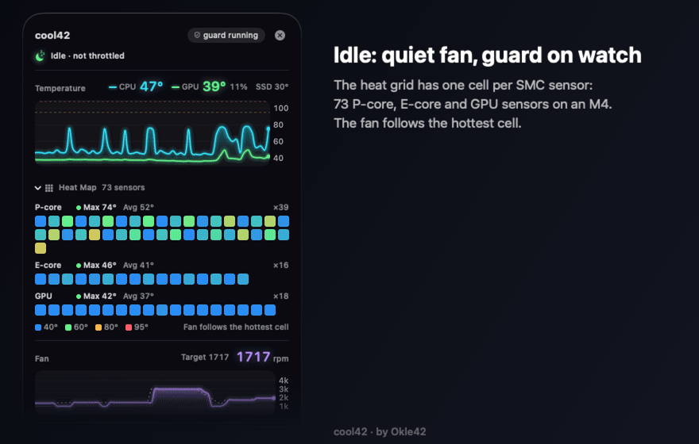
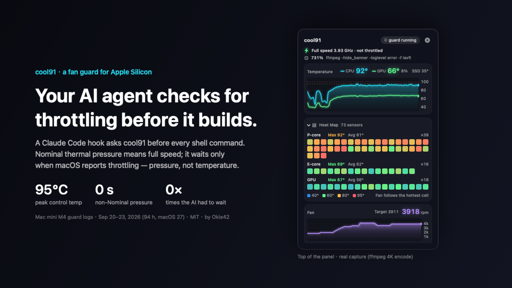
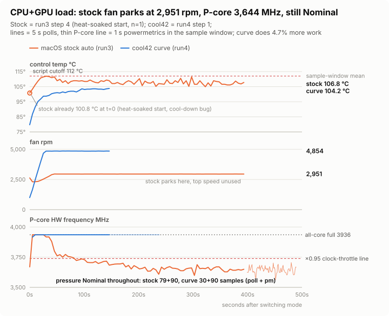
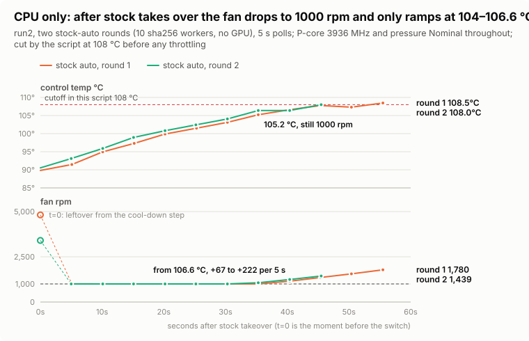
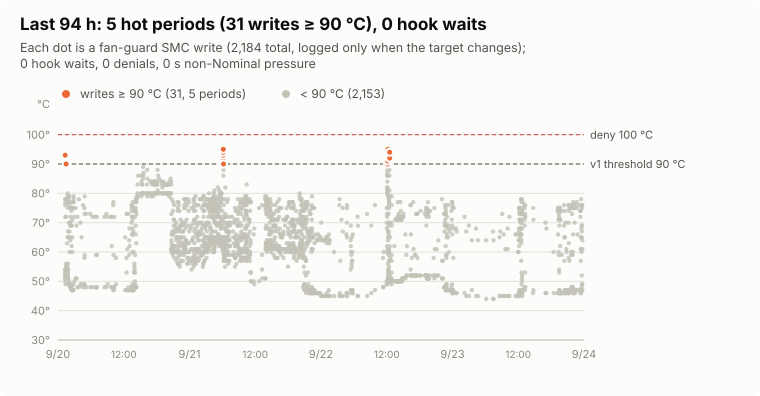
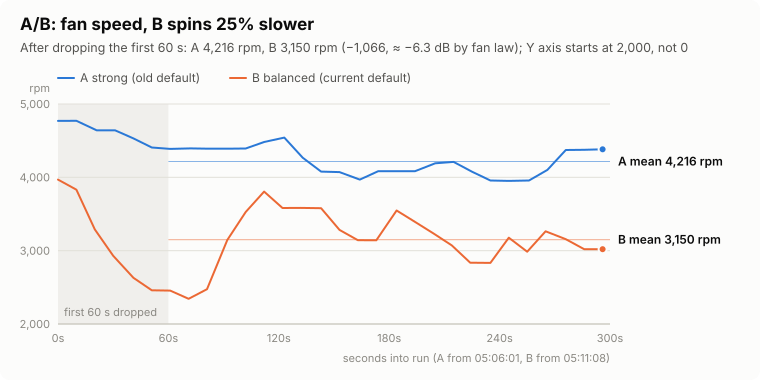
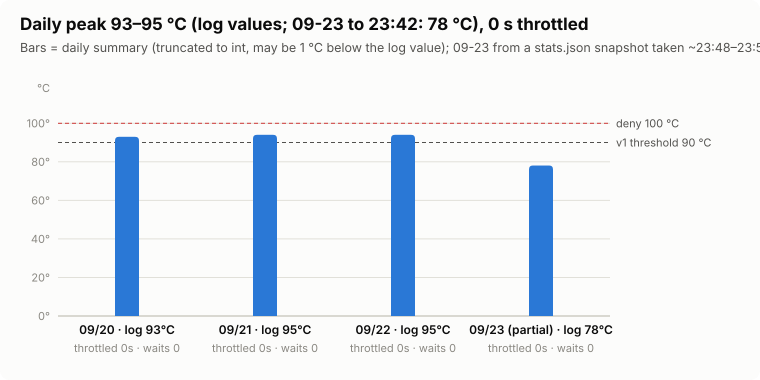

# cool42 — temperature / fan / clock monitor for Apple Silicon, plus a gatekeeper that stops AI agents from cooking your Mac

[繁體中文](README.md)

**In one line: your AI coding agent checks for throttling before heavy work — full speed while the Mac isn't throttling, hot or not (except at the ≥ 100 °C safety floor), and it waits only when it actually is.** "Throttling" means any of three signals: macOS thermal pressure above `Nominal`, the GPU capped by CLTM, or the P-core hardware clock dropping below its all-core full-load value. The third was added after a same-machine test on 2026-09-25 found **the P-cores 7.4% down while macOS still reported `Nominal`**, and it isn't in any release yet (see [Data](#data) and [What counts as throttling](#what-counts-as-throttling)).

<p align="center"></p>
<p align="center"><sub>18-second demo. The idle and heavy-load hold frames are real captures; the ~1.4 s transition between them is linearly interpolated (labelled "Transition · interpolated" — those numbers are not real readings); the "throttling" segment is a staged scenario (not a recorded event), and the terminal frames reproduce the source code's output format. The panel is shown in its English UI; cool42's own CLI / hook status strings inside the terminal frames are still Chinese, as in the product.</sub></p>



<sub>The hero's three numbers are from the 2026-09-25 same-machine test (CPU + GPU load; the stock steady state is a single run, see [Data](#data)); the panel on its right is a real capture from a different scenario (an ffmpeg 4K encode).</sub>

<sub>The panel in the GIF and hero above is rendered off-screen on a **solid background** (what you see with Reduce Transparency on). On macOS 26 and later the real panel uses Liquid Glass by default: cards are near-opaque and text outside the cards uses the system's vibrant colours. The two shots below are real screen captures (`scripts/snapshot/capture-glass.sh`, live data, controlled gradient behind the panel; Traditional Chinese UI):</sub>

<p align="center"> </p>

> A menu-bar panel that shows CPU / GPU temperature, every core's own sensor (73 CPU/GPU temperature sensors on an M4, as a heat grid), fan RPM, the P-cores' **hardware** clock (from `powermetrics`) and whether it's throttling (macOS thermal pressure, GPU CLTM, and — in the new version — the clock itself). Custom fan curves, overheat / cooled-down chimes with adjustable thresholds. The panel UI follows the system language: Traditional Chinese on a Traditional Chinese system, English everywhere else.
> Then the part no other monitor has: **when an AI agent like Claude Code runs heavy work on your Mac, let the machine go full speed, let the fan prevent throttling, and only make the work wait when throttling actually happens.**
> Resident cost (long-run `ps` average on 2026-09-23, cumulative CPU time ÷ uptime): guard + its `powermetrics` child **≈ 0.5% of one core** (0.27% + 0.22%), guard RSS ≈ 12–14 MB; the panel left open ≈ 1% (57 MB), closed-panel figure to be re-measured.

**Two ways to use it, one install:**

| | What you get |
|---|---|
| **Just a monitor + fan controller** (no Claude Code needed) | Things Apple doesn't tell you: what the P-cores are really clocked at right now, when throttling starts, which core is hottest, whether the GPU is being capped. Fan modes Curve / Fixed / Automatic, edited live from the panel, with Quiet / Balanced / Performance presets |
| **A gatekeeper for AI agents** | Claude Code asks before launching heavy commands (hook + MCP), waits only when the Mac is actually throttling (pressure above Nominal, GPU CLTM, and in the new version a clock drop), spins the fan up *before* `swift build` / `blender` / `ffmpeg`, and daily stats tell you whether your curve is right |

**In plain words**: Apple's fan policy is silence-first. On 2026-09-25 I measured it on this Mac mini M4, same machine and same load: with CPU + GPU fully loaded, macOS auto held the fan at about 2,950 rpm (the firmware maximum of 4,900 went unused) at 106.8 °C, and the P-core hardware clock fell from the full 3936 to an average of 3644 MHz (−7.4%) — while macOS thermal pressure read `Nominal` the whole time. The clock dropped and the system didn't say so (the drop is measured; blaming heat is an inference, see [Data](#data)). The same load on cool42's default curve: fan 4,877 rpm, 104.4 °C, P-cores at the full 3936, 4.7% more work per second. The price is fan noise (≈ +10.9 dB estimated from rpm, not measured) and 17.5% more CPU power. The stock steady state is a single run; limits are under [Data](#data). cool42 first makes this **visible** (the panel's first line says "Full speed · not throttled" or "Throttling"), then has Claude Code wait only when the Mac is actually throttling. It also survives the moments the machine is busiest — learned the hard way, see problem 15 below.

    

---

## Why

It started with wanting to *see*. I hand a lot of engineering work to Claude Code: several agents building, computing geometry, generating 3D models at once. One day I looked at the temperature:

```
CPU 105°C   fan 1774 rpm (macOS auto)
```

The Mac mini M4's stock fan policy is extremely conservative — **CPU already at 105 °C, fan at 1774 rpm**. External reports (other people's machines) say that after 10–15 minutes of load like that the P-cores drop from 4.46 GHz to 3.3–3.8 GHz with no indication. Later I measured it on this machine (2026-09-25, CPU + GPU load): macOS auto let the P-cores fall from the all-core full-load 3936 to 3644 MHz (−7.4%) with thermal pressure `Nominal` throughout — a smaller drop than the external reports (their baseline is the 4464 single-core peak), but just as silent. Existing monitors and fan tools can show temperature and raise the curve, but:

1. **They don't know whether you're throttled** — they watch temperature, not hardware clocks; many of them read the PMU temperature on M4, which sits 15–20 °C below the cores (problem 14)
2. **GUI only, no CLI, no API** — an AI agent can't ask "is it OK to start now?"
3. **They're all resident GUI apps** — heavy for something that reads a handful of SMC keys

I wanted something that **sees the truth** (hardware clocks, per-core temperatures), **can be called from a script**, **plugs into a Claude Code hook**, and **costs almost nothing**. That's cool42.

## Features

**Monitoring and fan control (for anyone)**

| | cool42 | typical monitor / fan tool |
|---|---|---|
| Menu bar | ✅ `🟡 82°`; click for temperature / fan / clock cards with 5-minute charts | ✅ |
| **Per-core temperature** | ✅ heat grid: P-core / E-core / GPU groups, 73 CPU/GPU temperature sensors (SMC) on M4, hover for value | partial (usually averages or PMU) |
| **Hardware clock / thermal throttling detection** | ✅ shows the P-core hardware GHz from `powermetrics`; throttling = thermal pressure above Nominal or GPU CLTM, and the unreleased new version adds a **clock check** — a hot P-cluster below 95% of its all-core full-load clock counts too, because pressure was measured reading `Nominal` while already throttled; panel / statusline turn red, logged | ❌ |
| **GPU utilisation / GPU throttling** | ✅ IOReport utilisation and clock, `GPU_CLTM` detection | ❌ |
| Custom fan curve | ✅ Curve / Fixed / Automatic, live edit from the panel, hot-reload on save | ✅ |
| CPU + GPU together | ✅ max of both drives the fan | ✅ |
| No fan hunting | ✅ fast up, slow down, max −300 rpm per 5 s | partial |
| Chimes | ✅ overheat / throttled and cooled-down, bundled sounds replaceable, thresholds adjustable in the panel | partial |
| **Who's computing right now** | ✅ `cool42 top` / one line in the panel: top CPU commands with working directory | ❌ |
| Daily stats | ✅ seconds throttled, seconds hot / critical, peak — one number tells you if the curve is right | ❌ |
| Resident cost | **≈ 0.5% of one core**, guard ≈ 12–14 MB (long-run measurement, including the `powermetrics` child) | usually tens of MB |
| Dependencies | **0** (pure Swift + about 170 lines of C, builds with SwiftPM) | mostly closed source |
| New chips (M5 / M6…) | sensors are scanned dynamically; change a prefix in config | wait for the author |
| License | MIT | mostly closed source |

**For AI agents (unique to cool42)**

| | |
|---|---|
| **Gate hook** | Claude Code PreToolUse hook: **waits only when actually throttled** (pressure above Nominal, GPU CLTM, clock drop in the new version); hot-but-not-throttled runs; denies only on Trapping or ≥ critical |
| **MCP server** | 7 tools so the AI can check status, decide whether to start, wait for cool-down, see who's eating CPU, switch fan mode |
| **Pre-warm for heavy commands** | fan ramps before `swift build` / `blender` / `ffmpeg`… |
| CLI for scripts | `cool42 check` returns exit code 0 / 1 / 2 |
| Survives heavy load | Standard QoS + watchdog; keeps the fan speed across restarts |
| Statusline snippet | Claude Code statusline shows `🌡85°🌀4896⚡3.9G`, ⚡ turns red when throttled |

## Data

Everything below was measured on this Mac mini M4 — nothing simulated — and the raw files are in the repo, so the numbers can be recomputed: the same-machine comparison lives in [`docs/perf-2026-09-25/`](docs/perf-2026-09-25/) (`python3 docs/perf-2026-09-25/recompute.py`, notes in Chinese), and the other charts come from [`extras/viz/build_charts.py`](extras/viz/build_charts.py) reading a frozen log snapshot.

### macOS auto vs the cool42 curve: same machine, same load (2026-09-25)

The load is 10 sha256 workers plus a full Metal GPU load (`extras/gpu_burn.swift`); each mode waits for steady state, then samples `powermetrics` for 90 s. "macOS auto" is cool42 `mode=auto` (guard keeps running but hands the fan back to the SMC); "cool42 curve" is the current default, 60→1000 75→1800 85→2600 92→3600 97→4900.

| | macOS auto | cool42 default curve | Δ |
|---|---|---|---|
| control temp (sample-window mean) | 106.8 °C (max 108.9) | **104.4 °C** (runs: 104.2 / 104.7) | −2.4 °C |
| fan | 2,951 rpm (firmware max 4,900 unused) | 4,877 rpm | +65% |
| P-core hardware clock (`powermetrics`) | mean 3,644 MHz, **−7.4%** vs the full 3936 (P5–P95 3603–3686) | **3936 MHz** (180/180 samples) | +8.0% |
| work (sha256 ops/s) | 17,066 | **17,875** | **+4.7%** |
| thermal pressure | **Nominal** (polls 79/79, `powermetrics` 90/90) | Nominal (180/180) | — |
| CPU power | 20.34 W | 23.89 W | +17.5% |
| work per joule | 839 ops/J | 748 ops/J | stock 12% better |
| noise | — | — | ≈ +10.9 dB (**estimate**: 50·log10 of the rpm ratio, not measured) |

<picture><source media="(prefers-color-scheme: dark)" srcset="docs/img/charts/perf-cpugpu-en-dark.svg"></picture>

- **`Nominal` pressure does not mean "not throttled".** In the stock run the P-core clock slid down from t+30 s, and from t ≥ 150 s it stayed at 3599–3700 MHz; thermal pressure never left `Nominal`. The old guard installed at the time did log "throttling", but only because the GPU was being capped by CLTM (13–18%), and the two times it logged "throttling ended" the P-cores were still at 3761 / 3729 MHz ([`guard-log-2026-09-25-1110.txt`](docs/perf-2026-09-25/guard-log-2026-09-25-1110.txt)). With a CPU-only load and no GPU capping, a pressure-only check would have recorded the whole stretch as "not throttled" — hence the new [clock check](#what-counts-as-throttling). (At these temperatures the hook would already deny new work because of the ≥ 100 °C safety floor; what's missed is mainly the throttling verdict itself — stats, log, panel; see [below](#what-counts-as-throttling).) The 7.4% P-core drop is measured; attributing it to heat (the GPU was CLTM-capped 13–18% at the same time) is an inference — a power limit hasn't been ruled out directly.
- **Full speed, paid for in fan and power.** The cool42 curve spins the fan 65% faster and gets P-cores that don't slow down, +4.7% work per second and −2.4 °C. The throttled stock run is more efficient — 12% more work per joule — it's just slower. +4.7% is steady-state throughput, not "the same job finishes 4.7% sooner"; total job time wasn't measured.
- **The gap is bigger from a cold start.** In the same session (run4) every mode began after at least 120 s with the load stopped and the chip at 55 °C: the cool42 curve peaked at 105.2 / 105.7 °C over its two runs; macOS auto reached 112.6 °C within 35–40 s both times and was cut off by the script's safety limit, with the fan having reached only 1,437 / 1,714 rpm. 112.6 °C is the reading at the moment of the cut; the stock peak itself wasn't measured.
- **CPU only (no GPU load)**: within 5 s of taking over, macOS auto dropped the fan to 1000 rpm and left it there while the temperature climbed from 91.5 to 105.2 °C; it only started ramping at 104–106.6 °C (+67 to +222 rpm per 5 s). Until the script cut it off at 108 °C the P-cores stayed at 3936 and pressure `Nominal` — **it was cut before any throttling showed**, so this says nothing either way about whether stock throttles on a CPU-only load. The cool42 curve on the same load: steady state 93.1 / 92.8 °C, 4,022 / 3,997 rpm, 3936 MHz.

<picture><source media="(prefers-color-scheme: dark)" srcset="docs/img/charts/perf-cpu-auto60-en-dark.svg"></picture>

**Limits — how far this comparison goes:**

- The stock steady state is **one run (n = 1)**, and it was a **warm start**: a bug in that run's cool-down check (69.3 °C, "done" after 0 s) meant it began at 100.8 °C. Both cold-start stock runs hit the 112 °C cut-off, so there is no cold-start stock steady state.
- The stock run (run3) and the two curve runs (run4) are from two sessions about 40 minutes apart with different script versions (the differences are cool-down, limits and reporting; the load and the work counter are unchanged). Room temperature was not controlled.
- One Mac mini M4 (macOS 27.0). Noise is an estimate, not a measurement.
- Full conditions, the known bugs in all four sessions, line-by-line sources and the recomputation table: [`docs/perf-2026-09-25/README.md`](docs/perf-2026-09-25/README.md) (Chinese).

### Daily use: the 94-hour log (2026-09-20 to 09-23)

<picture><source media="(prefers-color-scheme: dark)" srcset="docs/img/charts/hook-timeline-en-dark.svg"></picture>

**Over 94 hours (2,184 SMC writes) there were 5 hot periods (a gap of more than 5 minutes starts a new one; 31 fan-guard writes at ≥ 90 °C in total, peaking at 95 °C), and during them the hook never waited or denied anything; 0 s of non-Nominal thermal pressure and 0 s of GPU CLTM capping.** That is the old guard's definition, which **doesn't look at clocks**, so the zero only says macOS reported nothing and the GPU wasn't capped — not that there was no silent throttling; the 09-25 test above is exactly a case of `Nominal` pressure while throttled. (Inference from the rule, not measured: the new clock check only engages at a control temperature ≥ 100 °C, and this log peaks at 95 °C, so by the rule it wouldn't have fired either.) The log records hook waits and denials, not every allowed call, so it doesn't show how many Bash calls actually went through the hook in those periods. (Inference: if heavy commands had run then, the first version's wait-at-90 °C rule would have made them wait.)

<picture><source media="(prefers-color-scheme: dark)" srcset="docs/img/charts/ab-rpm-en-dark.svg"></picture>

**Same load, 5 minutes per curve (first 60 s dropped): the current default averages 3,150 rpm vs the old curve's 4,216 (−25%) for only 3.8 °C more (83.0 → 86.8 °C).** (The ≈ −6 dB figure is a fan-law estimate, not a measurement.) There was no `powermetrics` sample inside the B window; on 09-25 the same curve held the P-cores at the full 3936 under a heavier CPU + GPU load, which is indirect support, but it's a different load.

<picture><source media="(prefers-color-scheme: dark)" srcset="docs/img/charts/daily-max-en-dark.svg"></picture>

**Daily peaks of 93 / 95 / 95 °C (log values; 09-23 only up to 23:42, 78 °C), 0 "seconds throttled" in total over 4 days.** In that version "seconds throttled" = cumulative seconds with thermal pressure above Nominal or GPU CLTM above 5%, with no clock check; the daily summary truncates the peak to an integer and reports 93 / 94 / 94.

Limits, stated plainly: one Mac mini M4 only; the 94-hour log and the 09-25 comparison ran on macOS 27.0 (the A/B and sensor comparisons were on macOS 26). In daily use, "throttled → hook waits" never happened in these 94 hours. In the 09-25 stock run, where the fan was deliberately handed to macOS, the old guard did flag throttling via GPU CLTM; by the rules the hook would then have denied new work because the control temperature was ≥ 100 °C (it waits only with `hookBlockOnCritical` off), not because it recognised throttling — and the log shows no hook waits or denials in that stretch. That was a test, not a daily-use record. The wait path is otherwise covered by unit tests, the staged segment of the demo above, and the guard's verdicts logged during that test. All 11 charts with table views: [`docs/viz/index.html`](docs/viz/index.html) (download and open in a browser; it has a 中文 / English switch, and `?lang=en` opens it in English).

## Architecture

```
AppleSMC (IOKit)                        powermetrics (root)
   │                                        │
   ▼                                        │
Sources/CSMC          ~170 lines of C: SMC open / read / write / enumerate keys, libproc
   │                                        │
   ▼                                        ▼
Sources/Cool42Core    Swift library: type decoding, sensor scan, fan curve, config, snapshot, clock reader, events
   │
   ├─► cool42 (CLI)
   │     ├─ guard   root LaunchDaemon; every 5 s writes F0Tg/F0Md from the curve
   │     │          keeps one powermetrics child for P/E-core hardware clocks and thermal pressure
   │     │          writes /var/run/cool42/state.json (snapshot + clocks + daily stats), history.json (5-min curves)
   │     │          consumes events in /var/run/cool42/events/ (pre-warm, hook stats), logs to /var/log/cool42.log
   │     ├─ hook    Claude Code PreToolUse(Bash) entry — reads the snapshot only, 9 ms; posts pre-warm events
   │     └─ status / check / wait / fan / sensors / chip / doctor
   │
   ├─► mcp/cool42_mcp.py   MCP server (Python, stdio): wraps the CLI as 7 tools
   │                      set_fan writes config → guard hot-reloads, same path as the panel, no root
   │
   └─► cool42-panel   menu-bar .app (user level, no root)
                      idle: reads the snapshot for the title only; open: reads history and draws
                      mode / curve edits → write config → guard sees the mtime and reloads
```

**Privilege separation is the heart of the design**: only guard needs root (writes SMC, runs powermetrics). Everything else — panel, hook, statusline — reads 644 JSON files. Non-root parts talk to guard through files: edit the config, or drop a small JSON into `/var/run/cool42/events/` (a 1733 directory: anyone can drop, nobody can list) that guard reads and deletes each round.

What a local process can reach through the root daemon, and the worst it can do: see the [threat model](#threat-model) below.

## Gate logic (Claude Code hook)

Principle: **let the machine go full speed, let the fan prevent throttling, and only make work wait when throttling really happens.** Heat is not the problem; throttling is.

guard reads thermal pressure and the P-core hardware clock from `powermetrics` as root, and GPU CLTM from IOReport; the hook, `cool42 check` and `cool42 wait` share one verdict:

| state | hook | `check` exit |
|---|---|---|
| not throttling (pressure Nominal, GPU not capped, clock not down) | allow regardless of temperature; if the command starts with `swift build` / `xcodebuild` / `blender` / `ffmpeg`… post a pre-warm event | 0 |
| **throttling**: pressure Moderate / Heavy, or GPU capped by CLTM > 5%, or a clock drop (new version, below) | **wait for recovery (up to 90 s) then allow**, with an explanation | 1 |
| Trapping / Sleeping | **deny**; can be disabled in config | 2 |
| temperature ≥ critical (108 °C) | deny regardless of pressure (safety floor) | 2 |

Without guard (no pressure available) it falls back to temperature: ≥ 95 °C wait, ≥ 100 °C deny.

**Allow-listed commands are never gated**: `cool42`, `kill`, `pkill`, `killall`, `ps`, `top`, `sleep`… — otherwise Claude couldn't even run the commands that cool things down. See `hookAllowCommands` in config.

### What counts as throttling

In guard's log, the daily "seconds throttled", the panel verdict, `status --short` and the hook, "throttling" means any of:

1. **thermal pressure above Nominal** (`powermetrics`)
2. **GPU capped by CLTM**: IOReport `CLTM-induced GPU Performance States` outside `NO_CLTM` for more than 5% of the time
3. **clock throttling** (**unreleased**: in the repo source, not in any release yet): control temperature ≥ `clockThrottleTemp` (default 100 °C) and the P-core hardware clock < the all-core full-load clock × `clockThrottleRatio` (default 0.95; on M4, 3936 × 0.95 ≈ 3739 MHz). It clears once the clock is back above × 0.97, or the temperature falls below `clockThrottleTemp` − `levelHysteresis` (default 3 °C). `status --short` shows it as "降頻(時脈)" (clock throttling)

Rule 3 was added after the 2026-09-25 test, where macOS auto let the P-cores drop 7.4% under a CPU + GPU load with pressure `Nominal` from start to finish (see [Data](#data)). Applying the rule to that data: the stock run at 106.8 °C and 3644 MHz ⇒ throttling; the cool42 curve at 104.4 °C and 3936 MHz ⇒ not. That is the rule applied after the fact — **the new guard hasn't run on real hardware yet**.

The all-core full-load clock comes from a table of measured values, currently only **Apple M4 = 3936 MHz** (all 450/450 `powermetrics` samples from the 09-25 curve runs read 3936). **Chips other than the M4 get no clock check by default.** To enable it, run an all-core load while the machine is cool and not throttling, read `P-Cluster HW active frequency` from `sudo powermetrics --samplers cpu_power`, and put it in the config:

```json
"clockThrottleTemp": 100,
"clockThrottleRatio": 0.95,
"clockFullLoadMHz": 3936
```

**How this relates to the critical safety floor (from the rules, not measured)**: the hook checks critical first — at a control temperature ≥ `criticalTemp` it denies (or waits, with `hookBlockOnCritical` off). The default used to be 100 °C, but on 09-25 the cool42 curve settled at 104.4 °C under the same CPU + GPU load with the P-core at full 3936 MHz — a 100 °C floor would deny AI work on a machine running at full speed, contradicting "wait only when actually throttled". So (from the unreleased version on) the default is **108 °C**: above cool42's full-load steady state, below what stock reaches from a cold start (both 09-25 runs passed 112 °C within 35–40 s). Silent throttling between 105 and 108 °C is left to the clock check (`clockThrottleTemp` 100 °C). Config files that hard-code `"criticalTemp": 100` need to be updated by hand.

A wrong value turns a normal clock into "throttling" and makes the hook wait for nothing, which is also why guard doesn't learn the peak by itself: when hot, a single core boosts to 4464, and once that's taken as the peak, the all-core 3936 looks throttled. `clockThrottleRatio` must be between 0.5 and 1 or the config is rejected (the previous one stays in effect).

The first version gated on temperature (wait at 90 °C). With the fan-saving curve, heavy-load temperatures sat at 77–93 °C (the A/B's B run, mean 86.8 °C), so above 90 °C every Bash call waited — trading progress for a meaningless number (from the first version's log, no longer on disk). The second version looked only at pressure: 90 °C with `Nominal` pressure runs straight through (the P-cores were around 3.6 GHz then; why that's below the all-core 3.94 GHz is only an inference — partial load or the power limit). The 09-25 test showed pressure alone isn't enough, which is where the three-signal definition above comes from.

## Threat model

How a root daemon should be judged:

| Who reaches what | Worst case | Why it stops there |
|---|---|---|
| Any local process → `/var/run/cool42/events/` (1733) | Spin the fan to `boostRPM` for two minutes, inflate stats | guard only accepts regular files ≤ 4 KB (lstat, no symlink following), 64 per round; rpm and duration in the event file are ignored — root uses its own config values, then clamps to firmware `F0Mn–F0Mx`; notes are stripped of control chars and cut to 60 chars before reaching the log |
| User-level process → `/etc/cool42/config.json` (user-writable, read by root) | Flatten the curve so the CPU throttles, edit the hook allowlist | root **never takes a path or command from the config to execute** (sound paths are used only by the non-root panel); SMC firmware has its own thermal protection — worst case is slow, not broken |
| Any local process → runtime directory | — | `/var/run/cool42` is root 755; guard creates it with `mkdir(2)` + `lstat` to confirm it owns a real directory and refuses to start otherwise; writes use `O_EXCL\|O_NOFOLLOW`. Before 1.0.2 this lived in `/tmp`, where a fixed name plus a symlink let root overwrite arbitrary files — moved |
| Reading `/var/log/cool42.log` (644) | See who ran a heavy command when | Only the matched keyword (`swift build`) is logged, never the command itself — it may carry tokens or private paths |
| Claude Code hook stdin | — | String matching only, decides whether to wait; executes nothing |
| Subprocesses | — | `/usr/bin/powermetrics`, `/usr/bin/pgrep` by absolute path, `PATH` is not consulted |

Not done yet: Developer ID signing and notarization (currently ad-hoc; `install.sh` builds locally and self-signs).

## Install

**Tested on a Mac mini M4 only; fan keys on other models (MacBooks in particular) are unverified — see [Reports from other chips](#reports-from-other-chips) before installing.** Quit other fan controllers first (e.g. Macs Fan Control, including its menu-bar resident); two writers fight over the fan. Apple Silicon and macOS 14+ only. guard is a root LaunchDaemon, so installing asks for your password once — see the [threat model](#threat-model) for what it can and can't do.

**1. Homebrew (available once notarization is done)**

```bash
brew install okle42/tap/cool42 && cool42-setup
```

Releases are still ad-hoc signed and the tap isn't live yet; this path opens after Developer ID signing and notarization. `cool42-setup` installs the CLI, guard, Claude Code hook and MCP (asks for your password). Upgrade with `brew upgrade cool42 && cool42-setup`; remove completely with `brew uninstall --zap cool42` (a plain `brew uninstall` deliberately leaves guard running, so the fan isn't unmanaged mid-upgrade).

**2. Download the release zip (no swift, no clone) — available once the release is published**

There is no GitHub release for this version yet. Once there is:

```bash
V=1.0.3; T="$(mktemp -d)" && cd "$T" \
  && curl -fsSLO "https://github.com/Okle42/cool42/releases/download/v$V/cool42-$V-arm64.zip" \
  && curl -fsSLO "https://github.com/Okle42/cool42/releases/download/v$V/cool42-$V-arm64.zip.sha256" \
  && shasum -a 256 -c "cool42-$V-arm64.zip.sha256" \
  && ditto -xk "cool42-$V-arm64.zip" "$T" && "$T/cool42-$V/install.sh"
cool42 doctor    # all 16 checks green = done
```

The release is currently **ad-hoc signed and not notarized**: `install.sh` clears the quarantine attribute so it can run, which means you are vouching for the package yourself — read `install.sh` first. The temp directory comes from `mktemp -d` (writable only by you); don't swap it for a fixed `/tmp/...` path. `install.sh --skip-claude` leaves Claude Code's hook and MCP alone. Remove with `/usr/local/share/cool42/uninstall.sh` (config kept). Support files go to `/usr/local/share/cool42`, so the unzipped folder can be deleted afterwards. Release process: [`docs/RELEASING.md`](docs/RELEASING.md) (Chinese).

**3. From source**

Needs Xcode Command Line Tools (`swiftc`).

```bash
git clone https://github.com/Okle42/cool42.git
cd cool42
./install.sh     # build → CLI → guard LaunchDaemon (system password dialog) → Claude Code hook + MCP → menu-bar panel
cool42 doctor    # all 16 checks green = done
```

Remove with `./uninstall.sh` (explicitly runs `cool42 fan auto` to hand the fan back to macOS, config kept). If you only stop guard with `launchctl bootout`, run `sudo cool42 fan auto` afterwards — guard keeps the current fan speed on SIGTERM (see "Worst case" below).

The MCP server needs [`uv`](https://docs.astral.sh/uv/) (fetches `mcp` into an isolated env, never touches system Python); without `uv` or the `claude` CLI, install.sh skips that step and everything else still works.

## Usage

```bash
cool42 status            # temperature / clocks / fan / level / guard / daily stats / pre-warm
cool42 status --short    # 🟡 86°C 🌀3743rpm ⚡3.98GHz (adds "throttled(Moderate)" when it is)
cool42 check ; echo $?   # 0 = go, 1 = throttled, wait, 2 = deny (same verdict as the hook)
cool42 wait              # block until throttling ends; --below 85 waits for the control temp instead
cool42 top               # who's eating CPU (command + cwd), GPU utilisation and clock
cool42 doctor            # checks guard, snapshot, clocks, hook, config, log rotation, conflicting apps
cool42 sensors           # every temperature sensor (for porting to a new chip)
cool42 chip              # chip model and sensor grouping
sudo cool42 fan 3000     # manual RPM; sudo cool42 fan auto hands it back
tail -f /var/log/cool42.log
```

**Panel**: a floating window — click the menu-bar item to show / hide, drag it anywhere, it survives switching apps, follows you across Spaces, remembers its position and sizes itself to its content (drag the height once and it stays; right-click to go back to auto); ✕ top-right collapses it, right-click the menu-bar item for a menu. Dark neon style. First line is the verdict (full speed / throttling / dangerous), then "who's computing" (top two processes with cwd), then temperature / fan / P-core clock cards with 5-minute curves, daily stats, curve preview (current temperature and fan marked), mode picker Curve / Fixed / Automatic, Quiet / Balanced / Performance presets or per-point editing. Under the temperature card, "Heat Map" expands into the heat grid: P-core / E-core / GPU groups, one cell per SMC sensor (73 on M4), colour by temperature, hover for key and value; collapsed it reads nothing. The "Alert Sounds" card has two independent toggles (overheat / throttled, cooled-down) with ▶ preview and an adjustable trigger temperature each (≥ X° counts as hot, < Y° counts as cool). Two sounds are bundled; override with `"sounds": {"overheat": "~/x.mp3", "cooldown": "~/y.mp3"}` in config. Any change to fan or chimes shows a Discard / Apply bar at the bottom; "Relaunch" bottom-right relaunches the panel.

**Config** `/etc/cool42/config.json` (see `config.example.json`): curve, thresholds, smoothing, ramp limits, GPU inclusion, allow-list, pre-warm keywords, sensor prefixes, chimes. Hot-reloaded; a parse failure keeps the previous config.

**Log** `/var/log/cool42.log`: timestamped, records only SMC writes, level changes, throttling start / end, config reloads, pre-warms, sensor faults. Rotated by newsyslog at 1 MB.

**Claude Code MCP** (`claude mcp list` should show `cool42: ✔ Connected`). The hook is a passive gate; MCP lets the AI look and act:

| tool | CLI | |
|---|---|---|
| `cool42_status` | `status --json` | temperature / fan / clocks / level / pressure / daily stats / top processes |
| `cool42_check` | `check --json` | adds `verdict: ok / wait / block` — ask before heavy work |
| `cool42_top` | `top` | who's computing |
| `cool42_doctor` | `doctor` | troubleshooting |
| `cool42_wait` | `wait` | wait for throttling to end or `below_temp`, timeout ≤ 300 s |
| `cool42_get_config` | — | read config |
| `cool42_set_fan` | — | `mode=curve / fixed(rpm) / auto`; writes config for guard to hot-reload, rpm clamped to fan min–max |

`cool42_set_fan` deliberately does not call `sudo cool42 fan`: guard rewrites the SMC every 5 s from the curve, so a direct write would be overwritten — and an AI shouldn't hold sudo anyway.

**Claude Code statusline** (optional): `extras/statusline_snippet.py` reads `/var/run/cool42/state.json` and shows `🌡85°🌀4896⚡3.9G`; hides itself when guard isn't running.

## Is this good for the machine? Will the fan wear out?

**The stock policy first.** Apple's fan strategy is silence-first. The same-machine, same-load measurement on this Mac (2026-09-25, see [Data](#data) above): on a CPU-only load macOS auto first drops the fan to 1000 rpm and starts ramping only at 104–106.6 °C; on a CPU + GPU load the fan settles around 2,950 rpm at 106.8 °C (sample-window mean) and the P-cores fall from 3936 to 3644 MHz (−7.4%) with thermal pressure `Nominal` throughout — slower, silently. The stock steady state is a single run: the most direct data so far, not a verdict. Nothing in Apple's documentation mentions a target temperature or lifetime. External reports (other people's M4 minis) say that after 10–15 minutes of heavy load the SoC sits at 105–107 °C with the fan around 2100 rpm and the P-cores drop from 4464 MHz to 3300–3800 (about −15 to −26%); that baseline is the 4464 single-core peak, so it can't be compared directly with the −7.4% against the all-core 3936 here.

**cool42's default curve came out of an A/B test: 25% less fan than the old curve on the same load.** Same load (load 22–42), 5 minutes each (raw data in [`docs/ab-test-2026-09-16/`](docs/ab-test-2026-09-16/)):

| | old curve (aggressive) | **current default** | stock (external reports, not same machine / load) |
|---|---|---|---|
| curve | 55→1000 … 85→4200 90→4900 | 60→1000 75→1800 85→2600 92→3600 97→4900 | — |
| control temp (mean, range) | 83.0 °C (75–88) | **86.8 °C (77–93)** | 105–107 °C |
| fan (mean) | 4216 rpm | **3150 rpm** (−25%, ≈ −6 dB by the fan law) | ~2100 rpm |
| P-core / pressure | not sampled in the window | **not sampled in the window** | 3300–3800 MHz, throttled |

`powermetrics` was only sampled while the old curve was active: 3 samples before the A run and 6 samples starting ~3 minutes after the B run ended and the config was restored to A — 3936 MHz (one at 3950) and pressure Nominal. **There is no `powermetrics` sample inside the 5-minute B window**, so this A/B supports "25% less fan for 3.8 °C", not "B doesn't throttle". The 94 hours of daily stats since then show 0 s of non-Nominal pressure, but 09-25 showed pressure can miss silent throttling, so that isn't evidence either; the closest thing is the 09-25 comparison, where the same curve held 3936 MHz (180/180 samples, 104.4 °C) under a heavier CPU + GPU load. Different load, so still not a direct measurement under the A/B load. Total job time has not been measured either. The old curve's extra 1000 rpm buys 3.8 °C; it is still there as the "Performance" preset.

**Lifetime (inference)**: "every 10 °C halves the life" holds for electromigration-type mechanisms ([Electronics Cooling](https://www.electronics-cooling.com/2017/08/10c-increase-temperature-really-reduce-life-electronics-half/) notes it is not a general rule), and Apple's baseline life is long, so a cooler chip is at most a statistical failure-rate difference, not "breaks vs doesn't". Also often missed: **thermal cycling hurts more than steady heat**. In this machine's log cool42 swings 45 ↔ 95 °C; on 09-25 the same machine under macOS auto held 106.8 °C at CPU + GPU steady state and reached 112.6 °C within 35–40 s of a cold start (cut off by the script, true peak not measured), but there is no long-run stock swing data, so no ratio is given.

**The fan**: industrial L10 = 70,000 h @ 40 °C, life ∝ (rated ÷ actual rpm)^1.5; even 8 h/day at full speed is 24 years. The real cost is noise and dust. The ceiling is the firmware's own `F0Mx` (4900 on the M4 mini), which Apple uses itself in hot rooms. What actually hurts fans is **frequent start/stop and violent speed changes** — exactly what the asymmetric EMA + ramp limit + deadband prevent: cooling down is capped at −300 rpm per 5 s, so 4900 → 1000 takes at least 65 s. Idle sits at the firmware minimum 1000, same as Apple auto.

**How to know the curve is right**: `cool42 status` daily stats, one number — **seconds throttled should be 0**; if not, raise the hot end of the curve. Note that up to 1.0.3 this counts only pressure and GPU CLTM, so 0 s doesn't rule out silent throttling; the unreleased new version adds the clock check (chips other than the M4 need `clockFullLoadMHz` set), and only then does 0 really mean the fan did its job. To check directly, watch the P-core clock in the panel or `cool42 status` under heavy load and see whether it drops below the all-core full-load value.

**Worst case**: guard dies → launchd `KeepAlive` restarts it in seconds. On exit, SIGINT (Ctrl-C) / SIGHUP hand the fan back to auto; **SIGTERM (launchd stop / restart, including a manual `launchctl bootout`) keeps the current fan speed** so the restarted guard can take over (handing back to auto under heavy load hits 100 °C in 30 s) — so after stopping guard by hand the fan stays at its last manual speed; run `sudo cool42 fan auto` or `uninstall.sh`, both of which hand it back explicitly. Even with no one in control the SoC has its own hardware protection (throttle, then shutdown). Blow the dust out once a year.

## Measurements (Mac mini M4; sensor comparisons and A/B on macOS 26, the 94-hour runtime log and the 09-25 stock comparison on macOS 27.0)

The log the first time it took over (old curve; early log, the raw file has since been rotated):

```
cool42 guard started (Apple M4, 1 fan, every 5.0s, mode curve, controlling)
🔴 105°C 🌀1774rpm → target 4900 rpm     ← before: macOS auto gave 1774
🟠 100°C 🌀4900rpm
🟠  93°C 🌀4899rpm
🟡  82°C 🌀4618rpm                      ← 20 s later, −23 °C
```

Resources (`ps` on 2026-09-23, cumulative CPU time ÷ 3 days 22 hours of uptime): `guard` 0.27% of one core, RSS ≈ 12–14 MB; `powermetrics` child 0.22%; ≈ 0.49% together. The panel left open ≈ 1.17%, RSS 57 MB (closed-panel figure to be re-measured). `cool42 hook` 9 ms per call and `cool42 status` 0.18 s (including SMC open) are earlier measurements.

## Problems worth knowing about

The Chinese README has the full list of 19; the ones that matter most if you build on this:

**Apple Silicon SMC is undocumented.** IOKit `AppleSMC`, `IOConnectCallStructMethod` selector 2, an 80-byte `SMCKeyData_t` that must match byte for byte. Written in C; Swift only decodes types (`flt`, `sp78`, `fpe2`, `ui8/16/32`…).

**Nobody knows the sensor key names.** M4 exposes **1375 SMC keys in total** (73 of them are CPU/GPU temperature keys on this machine). Nothing is hard-coded: at start, scan every `T*` key of type `flt`/`sp78` with a value in 10–120, then group by prefix (M4: `Tp*` P-core, `Te*` E-core, `Tg*` GPU, `TH0*` SSD). Prefixes live in config; a new chip is a config change.

**Hardware clocks on M4 are root-only.** IOReport (what macmon / asitop use) reports the *software-requested* DVFS state — under heavy load it sits at the top state (4464) while the hardware actually runs 3936 after power/thermal limiting. Throttling happens exactly there, invisible to IOReport. Only `powermetrics` reads the hardware counters, and it needs root — so guard, already root, keeps one `powermetrics -i 5000` child (≈ 0.22% of one core long-run). (`-n 0` is not infinite; omit `-n`.)

**Other tools show "CPU temperature" 15–20 °C lower.** They read IOHID `PMU tdie` — the Power Management Unit, a separate IC on the board that feeds the SoC. Its trend follows the CPU but it's physically far from the hot spots. M1 still exposed `pACC MTR Temp Sensor` via IOHID; M4 doesn't. cool42 reads the SMC `Tp*` keys next to each P-core, which is also what Apple's own `TCMz` (SoC max) aggregates — measured identical.

**guard starved under load — dead exactly when needed.** The first LaunchDaemon used `ProcessType Background` + `Nice 10`. At load 35 it took three minutes to finish its first round: 1375 SMC calls queued in `mach_msg2_trap` while a normal process scanned the same keys in 0.2 s. Background QoS gets no CPU when the system is busy, and a fan guard is needed precisely then. Now `Standard` + `Nice -5` (actual usage ≈ 0.27% of one core), the scanned key list is cached in the snapshot, and a watchdog thread `_exit`s after 6 missed heartbeats so launchd restarts it (a process stuck in a kernel call can't even receive SIGTERM).

**Overwriting the binary in place gets you killed by the kernel.** `cp` onto `/usr/local/bin/cool42` → every new process dies with `OS_REASON_CODESIGNING` (signature cache on the old inode). `cp` to `.new` then `mv`.

**Thermal pressure says `Nominal` while the P-cores are 7.4% down.** cool42 first defined throttling as pressure above Nominal (plus GPU CLTM). On 2026-09-25, a same-machine stock-vs-curve run (`extras/perf_vs_temp.py`) handed a CPU + GPU load to macOS auto: the fan sat at 2,951 rpm and the P-cores slid from 3936 to an average of 3644 MHz, with pressure `Nominal` in 79/79 polls and 90/90 `powermetrics` samples. The guard of the day only logged throttling because the GPU happened to be CLTM-capped 13–18% (the hook would have denied work then because the temperature was past the 100 °C safety floor, not because it recognised throttling), and twice declared it over while the P-cores were still at 3761 / 3729. The fix is the clock check ([What counts as throttling](#what-counts-as-throttling)), using a measured full-load table instead of letting guard learn the peak, since what it would learn is the 4464 single-core boost. The measurement had its own traps: a cool-down that watched only the chip (it drops below 70 °C in seconds while the heatsink is still hot, so the next mode starts warm), and a stock cold start that reaches 112.6 °C in 35–40 s and hits the script's safety limit, so there's no cold-start stock steady state ([`docs/perf-2026-09-25/README.md`](docs/perf-2026-09-25/README.md), Chinese).

**"Who's computing" without powermetrics.** `powermetrics --samplers tasks` costs +2.7% resident and its per-process GPU time is always 0 on Apple Silicon. CPU: `libproc` deltas of per-process CPU time — note `pti_total_user/system` are Mach ticks (125/3 ns) on Apple Silicon, not ns; forget the conversion and you undercount 41×. GPU: IOReport `GPU Performance States` (non-OFF share = utilisation) and `CLTM-induced GPU Performance States` for thermal capping (> 5% non-`NO_CLTM` = GPU throttled).

## Porting to a new chip (M5 / M6…)

1. `cool42 sensors` lists every temperature key and its value
2. `cool42 chip` shows the current grouping
3. Adjust `cpuPrefixes` / `gpuPrefixes` in config
4. If the fan keys are no longer `F0Ac/F0Tg/F0Md`, edit `fan(_:)` / `setFan` in `Sources/Cool42Core/SMC.swift`
5. If `powermetrics` output changes, edit the parser in `Sources/Cool42Core/FreqReader.swift`

## Reports from other chips

Only tested on a **Mac mini M4**. M1 / M2 / M3, Pro / Max / Ultra and MacBooks (battery sensors, possibly different fan keys, no fan on the Air) are untested. Whether it works or not, please open an [issue](https://github.com/Okle42/cool42/issues/new?template=chip-report.yml) with:

```bash
cool42 chip        # chip model, sensor grouping, fan count
cool42 sensors     # every temperature key and its value
cool42 status      # do the readings make sense
cool42 doctor      # which check is not green
```

That's enough to add your chip's prefixes and fan keys to the defaults so the next release works without a config change.

## Layout

```
Sources/CSMC/           about 170 lines of C: AppleSMC open / read / write / enumerate, libproc (cproc.c)
Sources/Cool42Core/     SMC decoding, Config, Snapshot / History / Event, FreqReader (powermetrics), Policy (verdict)
Sources/cool42/         CLI: main (dispatch), Hook, Guard, Doctor
Sources/cool42-panel/   menu-bar panel (SwiftUI + Charts)
Tests/Cool42CoreTests/  unit tests: curve interpolation, thresholds, config parse / validate, allow-list, pre-warm, verdict, old snapshots, powermetrics parsing
install/                LaunchDaemon plist, newsyslog config, Claude Code hook snippet
scripts/                install-root.sh (root steps), install-hook.py, install-mcp.sh, make-app.sh (panel bundle)
mcp/                    cool42_mcp.py: MCP server (PEP 723 single file, uv run --script)
Sounds/                 bundled chimes overheat.m4a / cooldown.m4a (synthesised, packed into the panel app)
extras/                 statusline snippet, perf_vs_temp.py + run_perf_overnight.sh (stock vs curve, same machine), gpu_burn.swift (GPU load), make_sounds.py (chime synthesis)
docs/                   A/B and stock-comparison data, findings, articles, charts
```

`swift test` runs the unit tests; `./install.sh` installs everything.

## Docs

- [`docs/findings-m4-sensors.md`](docs/findings-m4-sensors.md) — **technical findings (zh / en)**: IOReport clocks vs IOHID temperatures vs SMC vs powermetrics on M4, second-by-second comparison, which ones are real; stock fan policy numbers (including the 09-25 same-machine comparison); what an agent should use to self-throttle
- [`docs/perf-2026-09-25/`](docs/perf-2026-09-25/) — four same-machine sessions of macOS auto vs the cool42 curve: raw logs, `powermetrics` output, known bugs, recomputation script (Chinese)
- [`docs/perf-vs-temp.md`](docs/perf-vs-temp.md) — how to run the comparison script `extras/perf_vs_temp.py` (Chinese)
- [`docs/ab-test-2026-09-16/`](docs/ab-test-2026-09-16/) — raw A/B curve data, powermetrics output, external references
- [`docs/viz/index.html`](docs/viz/index.html) — interactive view of all 11 data charts (light / dark, table view, Chinese / English), generated by [`extras/viz/build_charts.py`](extras/viz/build_charts.py)
- [`docs/RELEASING.md`](docs/RELEASING.md) — release zip, signing / notarization, Homebrew tap (Chinese)
- [`CHANGELOG.md`](CHANGELOG.md)

## About

**[Okle42](https://github.com/Okle42)** builds AI agents into real working pipelines. cool42 is one example: about 4 days and 42 commits from 0.1 to 1.0.3, mostly written together with Claude Code; the four fixes in 1.0.1 came from having the agent read guard's own log. Questions, chip reports and collaboration: open an [issue](https://github.com/Okle42/cool42/issues).

## License

MIT
