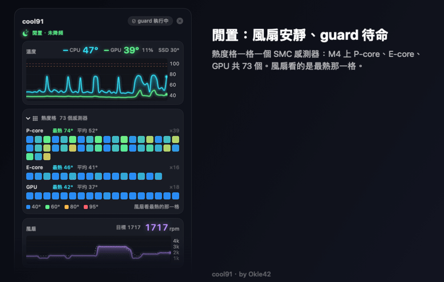
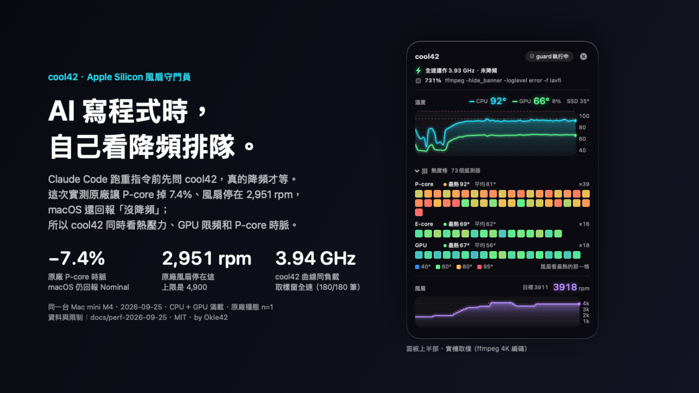
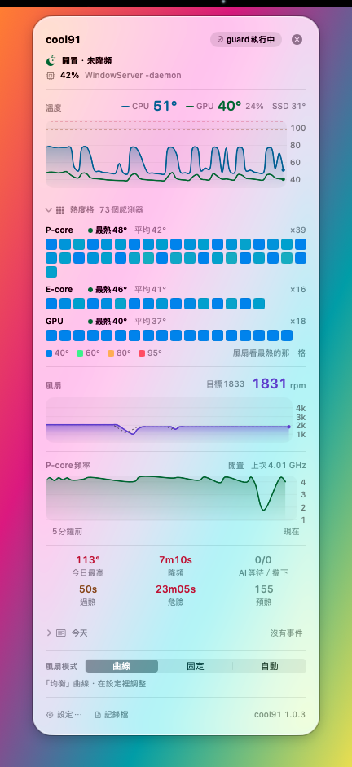
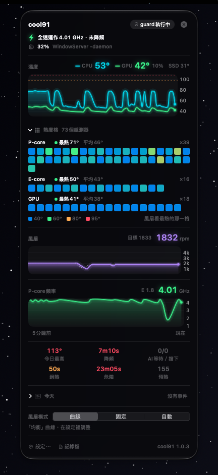
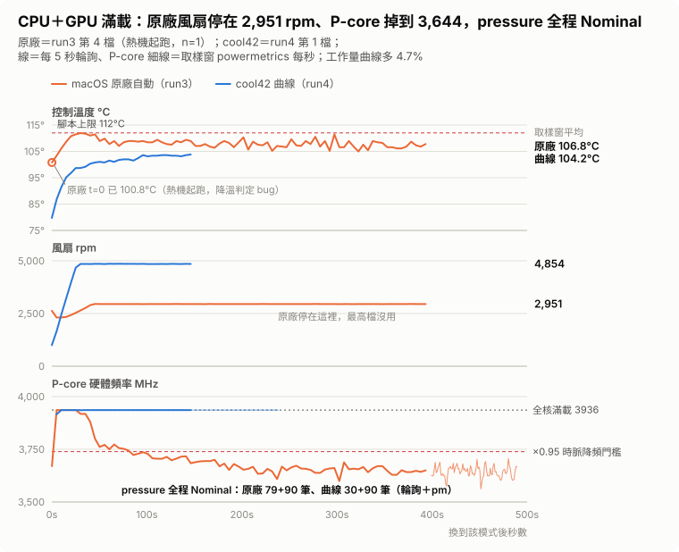
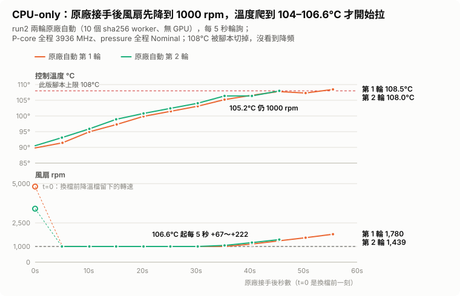
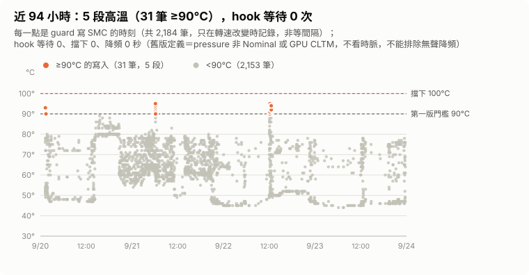
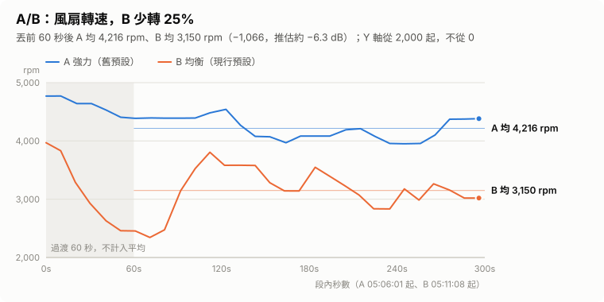
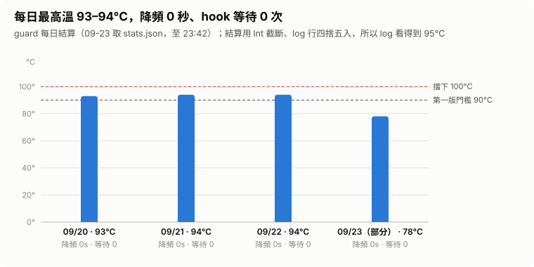

# cool42 — Apple Silicon 溫度 / 風扇 / 頻率監控面板，外加一個讓 AI 不燒機的守門員

[English](README.en.md) · *In English: an Apple Silicon temperature / fan / clock monitor whose Claude Code hook waits only when the Mac is actually throttling, not on temperature → [README.en.md](README.en.md)*

**一句話：AI 寫程式時自己看降頻排隊 —— 沒降頻就全速放行，溫度高也照跑（≥ 100°C 的安全底線除外）；真的降頻了才等。** 「降頻」看三個訊號：macOS 的 thermal pressure 非 Nominal、GPU 被 CLTM 限頻、P-core 硬體時脈掉到全核滿載以下。第三條是 2026-09-25 同機實測發現 **pressure 回報 Nominal 時 P-core 已經掉了 7.4%** 之後才加的，還沒進任何 release（見[數據](#數據)與[「降頻」的定義](#降頻的定義)）。

<p align="center"></p>
<p align="center"><sub>18 秒示意：閒置與重載兩個定格是實機資料；中間約 1.4 秒的過場是兩者之間線性內插的示意（幀上標「過場 · 內插示意」，那些數字不是實機讀數）；「降頻」那一段是受控情境（非實機紀錄），終端機畫面照原始碼格式重現。</sub></p>



<sub>hero 的三個數字出自 2026-09-25 同機實測（CPU＋GPU 滿載；原廠穩態只有 1 輪，見[數據](#數據)）；右邊的面板是另一個情境（ffmpeg 4K 編碼）的實機取樣。</sub>

<sub>上面 GIF 與 hero 裡的面板是離屏渲染的**實色底**（等同開了「減少透明度」）；macOS 26 以上實機預設是 Liquid Glass 玻璃底，卡片是近實色、卡片外的字用系統 vibrant 色。下面兩張是實機截圖（`scripts/snapshot/capture-glass.sh`，即時資料；面板後面墊的是受控的漸層背景）：</sub>

<p align="center"> </p>

> 選單列一眼看到 CPU / GPU 溫度、每顆核心各幾度（M4 共 73 個 CPU/GPU 溫度感測器的熱度格）、風扇轉速、P-core **硬體**頻率（powermetrics）、有沒有降頻（macOS 回報的 thermal pressure、GPU CLTM；新版另看時脈）；自訂風扇曲線，過熱 / 回穩有提示音，門檻自己調。面板介面跟著系統語言：系統是繁體中文就顯示繁中，其他語言顯示英文。
> 然後是別的監控工具沒有的部分：**當 Claude Code 這類 AI agent 在你的 Mac 上跑重工作時，讓機器全力開工、風扇負責避免降頻；只有真的降頻了才讓工作等一下。**
> 常駐成本（2026-09-23 `ps` 長期平均，累計 CPU 時間 ÷ 執行時間）：guard + powermetrics 子行程合計**單核約 0.5%**（0.27% + 0.22%），guard RSS 約 12–14 MB；面板一直開著約 1%（57 MB），收起時的數字待重測。

**兩種用法，裝一次都有：**

| | 你得到 |
|---|---|
| **只當監控 + 風扇控制**（不用 Claude Code 也行） | 原廠不會告訴你的東西：P-core 現在真的跑幾 GHz、什麼時候開始降頻、哪一顆核心最熱、GPU 有沒有被壓檔位；風扇曲線「曲線 / 固定 / 自動」面板即改即生效，內建安靜 / 均衡 / 強力三組 |
| **給 AI agent 當守門員** | Claude Code 開重指令前先問它（hook + MCP）、真的降頻（pressure 非 Nominal、GPU CLTM，新版加時脈降頻）才等一下、`swift build` / `blender` / `ffmpeg` 前先把風扇拉起來、每日統計告訴你曲線調得對不對 |

**白話版**：Apple 的風扇策略是安靜優先。2026-09-25 在這台 Mac mini M4 上同機同負載實測：CPU＋GPU 滿載時，macOS 原廠自動讓風扇停在約 2,950 rpm（韌體上限 4,900 沒用到），溫度 106.8°C，P-core 硬體頻率從全速 3936 掉到平均 3644 MHz（−7.4%），而 macOS 的 thermal pressure 全程回報 Nominal —— 時脈掉了，系統沒說（掉速是實測，歸因於熱是推論，見[數據](#數據)）。同一個負載交給 cool42 預設曲線：風扇 4,877 rpm、104.4°C、P-core 3936 全速，每秒工作量多 4.7%；代價是風扇聲（用轉速推估約 +10.9 dB，沒實測）和 CPU 多耗 17.5% 的電。這組原廠穩態只有 1 輪，限制見[數據](#數據)。cool42 先讓你**看到**這件事（面板第一行寫「全速運作 · 未降頻」或「降頻中」），再讓 Claude Code 只在真的降頻時才等一下。它自己在機器最忙的時候也不會掛掉（這是踩過坑才學到的，見下面第 15 條）。

    

---

## 為什麼要做這個

一開始只是想**看清楚**。我把大量工程工作交給 Claude Code 跑：多個 agent 同時 build、算幾何、產 3D 模型。某天看了一眼溫度：

```
CPU 105°C   風扇 1774 rpm（macOS 自動）
```

Mac mini M4 的預設風扇策略極度保守 —— **CPU 已經 105°C，風扇只有 1774 rpm**。外部報告（別人的機器）說這樣重載 10–15 分鐘後 P-core 會從 4.46 GHz 掉到 3.3–3.8 GHz，沒有任何提示。後來在這台機器上自己量（2026-09-25，CPU＋GPU 滿載）：原廠自動讓 P-core 從全核滿載的 3936 掉到 3644 MHz（−7.4%），thermal pressure 全程 Nominal —— 幅度比外部報告小（外部報告的基準是單核峰值 4464），但一樣沒有任何提示。現有的監控 / 風扇控制工具可以看溫度、拉高曲線，但有三個問題：

1. **不知道有沒有降頻** —— 它們只管溫度，看不到硬體頻率；很多工具在 M4 上讀的還是 PMU 溫度，比核心低 15–20°C（見第 14 條）
2. **純 GUI，沒有 CLI、沒有 API** —— AI agent 沒辦法問它「現在能不能開工」
3. **都是 GUI 常駐程式** —— 對於只想讀幾個 SMC key 的需求太重

我要的是：一個**看得到真相**（硬體頻率、每顆核心溫度）、**能被程式呼叫**、**能接進 Claude Code hook**、**幾乎不佔資源**的東西。這就是 cool42。

## 功能

**監控與風扇控制（任何人都用得到）**

| | cool42 | 一般監控 / 風扇工具 |
|---|---|---|
| 選單列顯示 | ✅ `🟡 82°`，點開有溫度 / 風扇 / 頻率三張 5 分鐘曲線圖 | ✅ |
| **每顆核心的溫度** | ✅ 熱度格：P-core / E-core / GPU 三組，M4 共 73 個 CPU/GPU 溫度感測器（SMC），滑過看度數 | 部分（多為平均或 PMU 值） |
| **CPU 硬體頻率 / 熱降頻偵測** | ✅ 顯示 powermetrics 的 P-core 硬體 GHz；降頻判斷看 thermal pressure 非 Nominal 與 GPU CLTM，新版（未發布）另加**時脈判斷** —— 高溫時 P-core 掉到全核滿載 95% 以下也算，因為實測 pressure 會在已降頻時仍回報 Nominal；面板 / statusline 標紅、log 記錄 | ❌ |
| **GPU 使用率 / GPU 熱降頻** | ✅ IOReport 使用率與頻率、`GPU_CLTM` 熱限制偵測 | ❌ |
| 自訂風扇曲線 | ✅ 曲線 / 固定 / 自動，面板可即時改，存檔即熱重載 | ✅ |
| CPU + GPU 一起看 | ✅ 取兩者最高值決定風扇 | ✅ |
| 風扇不忽高忽低 | ✅ 升溫快反應、降溫慢放，每 5 秒最多降 300 rpm | 部分 |
| 提示音 | ✅ 過熱 / 降頻、降溫回穩各一段，內建音效可換，觸發溫度面板可調 | 部分 |
| **現在誰在算** | ✅ `cool42 top` / 面板一行：CPU 前幾名的命令與工作目錄 | ❌ |
| 每日統計 | ✅ 降頻秒數、hot / critical 秒數、最高溫 —— 一個數字判斷曲線對不對 | ❌ |
| 常駐負載 | **單核約 0.5%**、guard 約 12–14 MB（長期實測，含 powermetrics 子行程） | 通常數十 MB |
| 外部依賴 | **0**（純 Swift + 約 170 行 C，SwiftPM 直接 build） | 多為閉源 |
| 新晶片（M5 / M6…） | 感測器動態掃描，改 config 前綴即可 | 等作者更新 |
| 授權 | MIT | 多為閉源 |

**AI agent 專屬（cool42 獨有）**

| | 說明 |
|---|---|
| **把關 hook** | Claude Code PreToolUse hook：**真的降頻才等**（pressure 非 Nominal、GPU CLTM，新版加時脈降頻），溫度高但沒降頻照跑；Trapping 或 ≥ critical 才擋 |
| **MCP server** | 7 個 tool 讓 AI 主動查狀態、判斷可否開工、等降溫、看誰在吃 CPU、切風扇模式 |
| **重指令預熱** | Claude 要跑 `swift build` / `blender` / `ffmpeg`… 前先把風扇拉起來 |
| CLI / 腳本可查詢 | `cool42 check` 回 exit code 0/1/2，任何腳本都能接 |
| 高負載下自己不會掛 | Standard 優先權 + watchdog；重啟時風扇維持不放手 |
| 狀態列片段 | Claude Code statusline 顯示 `🌡85°🌀4896⚡3.9G`，降頻時 ⚡ 變紅 |

## 數據

以下都是這台 Mac mini M4 的實測（不是模擬），原始檔都在 repo 裡、數字可重算：同機對照在 [`docs/perf-2026-09-25/`](docs/perf-2026-09-25/)（`python3 docs/perf-2026-09-25/recompute.py`），其餘的圖由 [`extras/viz/build_charts.py`](extras/viz/build_charts.py) 讀 repo 內凍結的 log 快照產生。

### 原廠自動 vs cool42 曲線：同一台、同一個負載（2026-09-25）

負載是 10 個 sha256 worker 加 Metal GPU 滿載（`extras/gpu_burn.swift`），每檔等穩態後取樣 90 秒 powermetrics；「原廠自動」是 cool42 `mode=auto`（guard 照跑、但風扇交還 SMC），「cool42 曲線」就是現行預設 60→1000 75→1800 85→2600 92→3600 97→4900。

| | macOS 原廠自動 | cool42 預設曲線 | 差 |
|---|---|---|---|
| 控制溫度（取樣窗平均） | 106.8°C（最高 108.9） | **104.4°C**（兩輪 104.2 / 104.7） | −2.4°C |
| 風扇 | 2,951 rpm（韌體上限 4,900 沒用到） | 4,877 rpm | +65% |
| P-core 硬體頻率（powermetrics） | 平均 3,644 MHz，比全速 3936 **−7.4%**（P5–P95 3603–3686） | **3936 MHz**（180/180 筆） | +8.0% |
| 工作量（sha256 ops/s） | 17,066 | **17,875** | **+4.7%** |
| thermal pressure | **Nominal**（輪詢 79/79、powermetrics 90/90） | Nominal（180/180） | — |
| CPU 功率 | 20.34 W | 23.89 W | +17.5% |
| 每焦耳工作量 | 839 ops/J | 748 ops/J | 原廠多 12% |
| 噪音 | — | — | 約 +10.9 dB（**推估**：50·log10 轉速比，沒有量） |

<picture><source media="(prefers-color-scheme: dark)" srcset="docs/img/charts/perf-cpugpu-dark.svg"></picture>

- **pressure Nominal 不等於沒降頻。** 原廠那一輪 P-core 從 t+30 秒起一路往下，t ≥ 150 秒都在 3599–3700 MHz，macOS 的 thermal pressure 一次都沒離開 Nominal。當時裝的舊版 guard 有記到「熱降頻」，但那是靠 GPU CLTM（13–18%）抓到的，中間兩次判「降頻結束」時 P-core 其實還是 3761 / 3729 MHz（[`guard-log-2026-09-25-1110.txt`](docs/perf-2026-09-25/guard-log-2026-09-25-1110.txt)）。如果只有 CPU 重載、GPU 沒被限，只看 pressure 會把這段整個記成「沒降頻」—— 所以新版加了[時脈判斷](#降頻的定義)。P-core 掉 7.4% 是實測；歸因於熱（同時有 GPU CLTM 13–18%）是推論，功耗上限的可能沒有直接排除。（這個溫度下 hook 本來就會因為 ≥ 100°C 的安全底線擋下新工作，漏掉的主要是「降頻」這個判定本身：統計、log、面板；見[下面](#降頻的定義)。）
- **換來的是全速，也花了電。** cool42 曲線多轉 65% 的風扇，換到 P-core 不掉速、每秒工作量 +4.7%、溫度 −2.4°C；原廠降頻比較省電，每焦耳工作量多 12%，只是做得比較慢。+4.7% 是穩態每秒工作量，不是「同一個工作快 4.7%」，總耗時沒量。
- **冷機起跑的峰值差更大。** 同一次實跑（run4）的四檔都先停負載至少 120 秒、降到 55°C 才開始：cool42 曲線兩輪全程最高 105.2 / 105.7°C；原廠兩輪 35–40 秒就到 112.6°C、被腳本的安全上限切掉，當時風扇最高只到 1,437 / 1,714 rpm。112.6°C 是被切那一刻的讀值，原廠真正的峰值沒量到。
- **CPU-only（沒有 GPU 負載）**：原廠接手後 5 秒內就把風扇降到 1000 rpm 停住，讓溫度從 91.5 爬到 105.2°C，到 104–106.6°C 才開始拉轉速（每 5 秒 +67～+222 rpm）；108°C 被腳本切掉之前 P-core 一直是 3936、pressure Nominal —— **沒看到降頻就被切了**，所以不能說原廠 CPU-only 會不會降頻。cool42 曲線同負載穩態 93.1 / 92.8°C、4,022 / 3,997 rpm、3936 MHz。

<picture><source media="(prefers-color-scheme: dark)" srcset="docs/img/charts/perf-cpu-auto60-dark.svg"></picture>

**限制（這組對照能說到哪裡）：**

- 原廠穩態只有 **1 輪（n = 1）**，而且是**熱機起跑**：那一輪的腳本降溫判定有 bug（69.3°C、0 秒就算降完），起跑就 100.8°C。冷機起跑的兩輪都在 112°C 被切，拿不到原廠冷機穩態。
- 原廠那輪（run3）和曲線兩輪（run4）來自相隔約 40 分鐘的兩次實跑，腳本版本不同（差異只在降溫、上限與報表，負載與工作量計數沒改）；室溫沒控制。
- 只有一台 Mac mini M4（macOS 27.0）。噪音是推估，不是量測。
- 完整條件、四次實跑的已知 bug、逐行出處與重算表：[`docs/perf-2026-09-25/README.md`](docs/perf-2026-09-25/README.md)。

### 日常運作：94 小時 log（2026-09-20～09-23）

<picture><source media="(prefers-color-scheme: dark)" srcset="docs/img/charts/hook-timeline-dark.svg"></picture>

**近 94 小時（2,184 筆 SMC 寫入）有 5 段高溫期間（間隔超過 5 分鐘算不同段；共 31 筆 ≥ 90°C 的寫入，最高 95°C），期間 hook 沒有任何一次等待或擋下；thermal pressure 非 Nominal、GPU CLTM 限頻都是 0 秒。** 這是舊版 guard 的定義，**不看時脈**，所以這個 0 只能說「macOS 沒回報、GPU 沒被限」，不能說「沒有無聲降頻」—— 上面 09-25 的實測就是 pressure Nominal 但已經降頻。（推論，照規則回推、沒實測：新版的時脈判斷要控制溫度 ≥ 100°C 才啟動，這 94 小時最高 95°C，照規則也不會觸發。）log 只記 hook 的等待與擋下、不記每次放行，所以不知道這些期間實際有幾次 Bash 呼叫經過 hook。（推論：若這些期間有重指令，第一版「90°C 就等」的門檻會讓它等。）

<picture><source media="(prefers-color-scheme: dark)" srcset="docs/img/charts/ab-rpm-dark.svg"></picture>

**同一負載 A/B 各 5 分鐘（扣前 60 秒）：現行預設平均 3,150 rpm，比舊曲線的 4,216 少 25%，溫度只多 3.8°C（83.0 → 86.8°C）。**（約 −6 dB 是用風扇定律推估，非實測。）A/B 的 B 段內沒有 powermetrics；09-25 用同一條曲線在更重的 CPU＋GPU 滿載下量到 P-core 3936 全速，算是間接佐證，但負載不同。

<picture><source media="(prefers-color-scheme: dark)" srcset="docs/img/charts/daily-max-dark.svg"></picture>

**每日最高 93 / 95 / 95°C（log 值；09-23 只到 23:42，78°C），4 天「降頻秒數」合計 0 秒。** 這是舊版的降頻秒數 = thermal pressure 非 Nominal 或 GPU CLTM > 5% 的累計秒數，不含時脈判斷；每日結算把最高溫整數截斷，寫成 93 / 94 / 94。

限制照實講：只有一台 Mac mini M4；94 小時 log 與 09-25 對照都在 macOS 27.0（A/B 與感測器對照是 macOS 26）。日常使用中「降頻 → hook 等待」在這 94 小時 log 裡沒發生過；09-25 把風扇刻意交給原廠的那一輪，舊版 guard 因 GPU CLTM 判到降頻；照規則那時 hook 會因控制溫度 ≥ 100°C 擋下新工作（`hookBlockOnCritical` 關掉才是等），不是因為認出降頻 —— 而且那段時間 log 裡沒有任何 hook 等待或擋下的紀錄；那是測試，不是日常紀錄。hook 等待這條路目前只有單元測試、上方 GIF 的受控示意，和這次測試中 guard 的判定紀錄。全部 11 張圖與表格檢視在 [`docs/viz/index.html`](docs/viz/index.html)（下載後用瀏覽器開；頁面可切換中文 / English）。

## 架構

```
AppleSMC (IOKit)                        powermetrics (root)
   │                                        │
   ▼                                        │
Sources/CSMC          約 170 行 C：SMC open / read / write / 列舉 key、libproc
   │                                        │
   ▼                                        ▼
Sources/Cool42Core    Swift library：型別解碼、感測器掃描、風扇曲線、設定檔、快照、頻率讀取、事件
   │
   ├─► cool42 (CLI)
   │     ├─ guard   root LaunchDaemon，每 5 秒依曲線寫 F0Tg/F0Md
   │     │          常駐一個 powermetrics 子行程讀 P/E-core 硬體頻率與 thermal pressure
   │     │          寫 /var/run/cool42/state.json（快照＋頻率＋今日統計）、history.json（5 分鐘曲線）
   │     │          收 /var/run/cool42/events/ 裡的事件（預熱、hook 統計），log 到 /var/log/cool42.log
   │     ├─ hook    Claude Code PreToolUse(Bash) 入口 —— 只讀快照檔，9 ms；重指令丟預熱事件
   │     └─ status / check / wait / fan / sensors / chip / doctor
   │
   ├─► mcp/cool42_mcp.py   MCP server（Python，stdio）：把上面的 CLI 包成 7 個 tool 給 AI 主動呼叫
   │                      set_fan 走「寫 config → guard 熱重載」，和面板同一條路，不需 root
   │
   └─► cool42-panel   選單列 .app（使用者層級，不需 root）
                      閒置只讀快照更新標題；打開才讀歷史檔畫圖
                      改模式 / 曲線 → 寫 config → guard 偵測 mtime 熱重載
```

**權限切分是整個設計的核心**：只有 guard 需要 root（寫 SMC、跑 powermetrics），其他所有東西 —— 面板、hook、statusline —— 都只讀 644 的 JSON 檔。非 root 元件要「告訴」guard 什麼事（面板改曲線、hook 要預熱）一律走檔案：改設定檔，或丟一個小 JSON 到 `/var/run/cool42/events/`（1733 目錄：能丟、不能看別人的），guard 每輪讀完就刪。

root daemon 能碰到什麼、最壞能做到什麼，見下面的[威脅模型](#威脅模型)。

## 把關邏輯（Claude Code hook）

原則：**讓機器全力開工，風扇負責避免降頻；只有真的降頻了才讓工作等。** 溫度高不是問題，降頻才是。

guard 以 root 從 `powermetrics` 讀 thermal pressure 與 P-core 硬體頻率、從 IOReport 讀 GPU CLTM，hook、`cool42 check`、`cool42 wait` 都看同一套判斷：

| 狀態 | hook 行為 | `check` exit |
|---|---|---|
| 沒降頻（pressure Nominal、GPU 沒被限、時脈沒掉） | 放行，不管幾度；指令開頭是 `swift build` / `xcodebuild` / `blender` / `ffmpeg`… 就先發預熱事件 | 0 |
| **降頻**：pressure Moderate / Heavy，或 GPU 被 CLTM 壓檔位 > 5%，或時脈降頻（新版，見下） | **等它恢復（最多 90 秒）再放行**，附說明 | 1 |
| Trapping / Sleeping | **擋下（deny）**；可在 config 關掉 | 2 |
| 溫度 ≥ critical（100°C） | 不管 pressure 都擋（安全底線） | 2 |

guard 沒跑、拿不到 pressure 時退回溫度門檻：≥ 95°C 等、≥ 100°C 擋。

**白名單指令不受限**：`cool42`、`kill`、`pkill`、`killall`、`ps`、`top`、`sleep`… 任何等級都放行，否則 Claude 連降溫的指令都跑不了。清單在 config `hookAllowCommands`。

### 「降頻」的定義

guard 的 log、每日「降頻秒數」、面板結論、`status --short` 與 hook 說的「降頻」，是以下任一成立：

1. **thermal pressure 非 Nominal**（powermetrics）
2. **GPU 被 CLTM 限頻**：IOReport `CLTM-induced GPU Performance States` 非 `NO_CLTM` 超過 5% 時間
3. **時脈降頻**（**尚未發布**：在 repo 原始碼裡，還沒進任何 release）：控制溫度 ≥ `clockThrottleTemp`（預設 100°C）且 P-core 硬體頻率 < 全核滿載頻率 × `clockThrottleRatio`（預設 0.95；M4 是 3936 × 0.95 ≈ 3739 MHz）。頻率回到 × 0.97 以上，或溫度降到 `clockThrottleTemp` − `levelHysteresis`（預設 3°C）以下才解除。`status --short` 顯示「降頻(時脈)」

第 3 條是 2026-09-25 實測之後加的：原廠自動在 CPU＋GPU 滿載下 P-core 掉了 7.4%，pressure 從頭到尾都是 Nominal（見[數據](#數據)）。拿那組數據套這條規則：原廠那輪 106.8°C、3644 MHz ⇒ 會判降頻；cool42 曲線 104.4°C、3936 MHz ⇒ 不會。這是照規則回推，**新版 guard 還沒實機跑過**。

全核滿載頻率用實測表，目前只收 **Apple M4 = 3936 MHz**（09-25 所有曲線檔 powermetrics 450/450 筆都是 3936）。**M4 以外的晶片預設不做時脈判斷**；要用的話，先在溫度低、沒降頻時跑全核滿載，用 `sudo powermetrics --samplers cpu_power` 讀 `P-Cluster HW active frequency`，再寫進 config：

```json
"clockThrottleTemp": 100,
"clockThrottleRatio": 0.95,
"clockFullLoadMHz": 3936
```

**和 critical 安全底線的關係（照規則推，不是實測）**：預設 `criticalTemp` 也是 100°C，而 hook 先看 critical —— 控制溫度 ≥ 100°C 就擋下（`hookBlockOnCritical` 關掉則改成等）。所以在預設設定下，09-25 那種 105–111°C 的無聲降頻，hook 本來就會因為溫度擋下；pressure 的盲點實際影響的是「降頻」這個紀錄：每日降頻秒數、log、面板與 `status` 的降頻標示。時脈判斷會直接改變 hook 行為的，是把 `criticalTemp` 調到 `clockThrottleTemp` 以上的設定。也要照實講：同一個 CPU＋GPU 滿載下，cool42 預設曲線也停在 104.4°C，高於 critical，照規則 hook 一樣會擋新的 Bash —— 這種極端負載，預設曲線壓不到 100°C 以下。

填錯會把正常頻率當成降頻、讓 hook 白等，所以不讓 guard 自己學峰值：高溫下單核會衝到 4464，被當成峰值之後，全核的 3936 就會被誤判成降頻。`clockThrottleRatio` 必須在 0.5–1 之間，否則設定檔會被拒收（保留上一份）。

第一版是純溫度門檻（90°C 就等）。換成省風扇的曲線後，重載溫度落在 77–93°C（A/B 的 B 段，平均 86.8°C），90°C 以上每個 Bash 前都在等 —— 拿工作進度換一個沒有意義的溫度數字（「每個 Bash 都在等」是第一版當時的 log，原始檔已不在）。第二版改成只看 pressure：同樣 90°C 但 pressure 是 Nominal，直接放行（當下 P-core 約 3.6 GHz，為什麼比全核 3.94 GHz 低，目前只是推論：部分負載或功耗上限）。09-25 的實測證明只看 pressure 不夠，才有現在的三條定義。

## 威脅模型

root daemon 該被怎麼看：

| 誰能碰到什麼 | 最壞能做到 | 為什麼止於此 |
|---|---|---|
| 本機任何程式 → `/var/run/cool42/events/`（1733） | 讓風扇轟 `boostRPM` 兩分鐘、統計灌水 | guard 只收 ≤ 4 KB 普通檔（lstat，不跟 symlink）、一輪 64 個；轉速與秒數不信事件檔裡的值，一律用 root 自己讀的 config，再夾在韌體 `F0Mn–F0Mx`；備註去控制字元、限 60 字才進 log |
| 使用者層級程式 → `/etc/cool42/config.json`（使用者可寫，root 讀） | 把曲線壓到最低讓 CPU 降頻、改 hook 白名單 | root **不從 config 取任何路徑或指令去執行**（音檔路徑只有非 root 的面板用）；SMC 韌體自己有過熱保護，最壞是慢，不會壞 |
| 本機任何程式 → 執行期目錄 | — | `/var/run/cool42` 是 root 755；guard 啟動用 `mkdir(2)`＋`lstat` 確認是自己的真目錄，不是就拒絕啟動；寫檔 `O_EXCL\|O_NOFOLLOW`。1.0.2 以前放 `/tmp`，固定檔名＋symlink 就能讓 root 覆寫任意檔，已搬 |
| 讀 `/var/log/cool42.log`（644） | 看到誰在什麼時候跑了重指令 | log 只記命中的關鍵字（`swift build`），不記指令原文 —— 原文可能帶 token、私人路徑 |
| Claude Code hook 的 stdin | — | 只做字串比對決定要不要等，不執行任何東西 |
| 子行程 | — | `/usr/bin/powermetrics`、`/usr/bin/pgrep` 絕對路徑，不吃 `PATH` |

還沒做的：Developer ID 簽章與 notarization（目前 ad-hoc，`install.sh` 在本機建置後自簽）。

## 安裝

**目前只在 Mac mini M4 實測；其他機型（尤其 MacBook）的風扇 key 未驗證，裝之前請先看下面的[其他晶片回報](#其他晶片回報)。** 先退出其他風扇控制程式（如 Macs Fan Control，含選單列常駐），兩者會互搶風扇。只支援 Apple Silicon、macOS 14 以上。guard 是 root LaunchDaemon，安裝時會跳一次系統密碼視窗 —— 它能做什麼、不能做什麼見上面的[威脅模型](#威脅模型)。

**1. Homebrew（公證完成後開放）**

```bash
brew install okle42/tap/cool42 && cool42-setup
```

目前 release 還是 ad-hoc 簽章、tap 尚未上線，這條路等 Developer ID 簽章與公證完成後開放。`cool42-setup` 裝 CLI、guard、Claude Code hook 與 MCP（會要系統密碼）；升級用 `brew upgrade cool42 && cool42-setup`，完整移除用 `brew uninstall --zap cool42`（只 `brew uninstall` 不會停 guard，避免升級途中風扇沒人管）。

**2. 下載 release zip（不需要 swift、不需要 clone）—— 待 release 上線後開放**

GitHub 上還沒有這個版本的 release；上線後用：

```bash
V=1.0.3; T="$(mktemp -d)" && cd "$T" \
  && curl -fsSLO "https://github.com/Okle42/cool42/releases/download/v$V/cool42-$V-arm64.zip" \
  && curl -fsSLO "https://github.com/Okle42/cool42/releases/download/v$V/cool42-$V-arm64.zip.sha256" \
  && shasum -a 256 -c "cool42-$V-arm64.zip.sha256" \
  && ditto -xk "cool42-$V-arm64.zip" "$T" && "$T/cool42-$V/install.sh"
cool42 doctor    # 16 項檢查全綠就對了
```

release 目前是 **ad-hoc 簽章、未公證**：`install.sh` 會替它清掉 quarantine 屬性才能執行，等於你自己替這個包擔保 —— 先讀過 `install.sh` 再跑。暫存目錄用 `mktemp -d`（只有你能寫），不要改成固定的 `/tmp/...` 路徑。`install.sh --skip-claude` 不動 Claude Code 的 hook 與 MCP；移除：`/usr/local/share/cool42/uninstall.sh`（設定檔保留）。支援檔會裝到 `/usr/local/share/cool42`，解壓目錄裝完可以刪。發布流程見 [`docs/RELEASING.md`](docs/RELEASING.md)。

**3. 原始碼安裝**

需要 Xcode Command Line Tools（有 `swiftc` 即可）。

```bash
git clone https://github.com/Okle42/cool42.git
cd cool42
./install.sh     # build → CLI → guard LaunchDaemon（跳系統密碼視窗）→ Claude Code hook + MCP → 選單列面板
cool42 doctor    # 16 項檢查全綠就對了
```

移除：`./uninstall.sh`（會明確 `cool42 fan auto` 把風扇交還 macOS，設定檔保留）。只想暫停 guard 的話，`launchctl bootout` 之後記得跑 `sudo cool42 fan auto` —— guard 收到 SIGTERM 會維持目前轉速（見下方「最壞情況」）。

MCP server 需要 [`uv`](https://docs.astral.sh/uv/)（自動抓 `mcp` 套件到隔離環境，不碰系統 Python）；沒有 `uv` 或 `claude` CLI 時 install.sh 會略過這一步，其他功能不受影響。

## 使用

```bash
cool42 status            # 溫度 / 頻率 / 風扇 / 等級 / guard 狀態 / 今日統計 / 預熱
cool42 status --short    # 🟡 86°C 🌀3743rpm ⚡3.98GHz（降頻時多一個「降頻(Moderate)」）
cool42 check ; echo $?   # 0=可開工 1=降頻中該等 2=該擋（和 hook 同一套判斷）
cool42 wait              # 阻塞到降頻結束；--below 85 改為等控制溫度降到 85 以下
cool42 top               # 現在誰在吃 CPU（命令列 + 工作目錄）、GPU 使用率與頻率
cool42 doctor            # 檢查 guard、快照、頻率、hook、設定檔、log 輪替、衝突程式
cool42 sensors           # 列出所有溫度感測器（移植新晶片用）
cool42 chip              # 晶片型號與感測器分組
sudo cool42 fan 3000     # 手動設轉速；sudo cool42 fan auto 交還
tail -f /var/log/cool42.log
```

**面板**：浮動視窗，點選單列圖示開 / 關、可拖到任何地方、切到別的 app 不會消失、跨 Space、位置記住、高度跟內容走（自己拖過就固定，右鍵可恢復自動）；右上角 ✕ 收起，右鍵圖示有選單。漸層微光風格（深色底、霓虹發光線、線下漸層）。頂端一句結論（全速運作 / 降頻中 / 溫度危險），下面一行「現在誰在算」（前兩名 process 的命令與工作目錄），溫度 / 風扇 / P-core 頻率三張卡各帶目前值與 5 分鐘曲線，今日統計列，曲線預覽圖（標出目前溫度與風扇位置），模式「曲線 / 固定 / 自動」，內建「安靜 / 均衡 / 強力」三組曲線，也可逐點自訂，按「套用」即生效。溫度卡下方「熱度格」展開：P-core / E-core / GPU 三組，一格一個 SMC 感測器（M4 共 73 個），顏色隨溫度變，滑過看 key 與度數，收合就不讀。底下「提示音」卡：過熱 / 降頻響一聲、降溫回穩響一聲，兩個開關獨立、▶ 試聽，每列有觸發溫度可調（≥ 幾度算熱、< 幾度算涼），按「套用」生效；內建兩段音效，想換在 config 設 `"sounds": {"overheat": "~/x.mp3", "cooldown": "~/y.mp3"}`。風扇或提示音有改動，底部出現「捨棄 / 套用」；右下「重新啟動」可重開面板。

**設定檔** `/etc/cool42/config.json`（範例見 `config.example.json`）：曲線、門檻、平滑係數、降速斜率、GPU 是否納入、白名單、預熱關鍵字、感測器前綴都在這。改了不用重啟，解析失敗會保留上一份。

**log** `/var/log/cool42.log`：帶時間戳，只記「寫了 SMC」「等級變化」「降頻開始 / 結束」「設定重載」「預熱」「感測器異常」，不會每輪一行；超過 1 MB 由 newsyslog 輪替（`/etc/newsyslog.d/cool42.conf`）。

**Claude Code MCP**（`claude mcp list` 應看到 `cool42: ✔ Connected`）。hook 是被動閘門，MCP 是讓 AI 主動看得到、動得了：

| tool | 對應 CLI | 說明 |
|---|---|---|
| `cool42_status` | `status --json` | 溫度 / 風扇 / 頻率 / 等級 / pressure / 今日統計 / 誰在吃 CPU（去掉感測器 key 清單省 token） |
| `cool42_check` | `check --json` | 多一個 `verdict: ok / wait / block`，開重負載前先問 |
| `cool42_top` | `top` | 現在誰在算 |
| `cool42_doctor` | `doctor` | 排障 |
| `cool42_wait` | `wait` | 等降頻結束或 `below_temp`，timeout 上限 300 秒 |
| `cool42_get_config` | — | 讀設定檔 |
| `cool42_set_fan` | — | `mode=curve / fixed(rpm) / auto`；寫設定檔讓 guard 熱重載，rpm 夾在風扇 min–max，guard 沒跑會警告 |

`cool42_set_fan` 故意不呼叫 `sudo cool42 fan`：guard 每 5 秒會把 SMC 寫回曲線值，直接寫 SMC 只會被蓋掉，而且 AI 不該拿 sudo。手動註冊：`./scripts/install-mcp.sh`。

**Claude Code 狀態列**（選用）：`extras/statusline_snippet.py` 讀 `/var/run/cool42/state.json` 顯示 `🌡85°🌀4896⚡3.9G`（降頻時 ⚡ 變紅加 ↓），guard 沒在跑就自動隱藏。

## 這樣長期跑對機器好嗎？風扇會不會操壞？

**先講原廠設定的真相。** Apple 的風扇策略是「安靜優先」。這台機器的同機同負載實測（2026-09-25，見上面[數據](#數據)）：CPU-only 滿載時原廠先把風扇降到 1000 rpm，到 104–106.6°C 才開始拉；CPU＋GPU 滿載時風扇停在約 2,950 rpm、溫度 106.8°C（取樣窗平均），P-core 從 3936 掉到 3644 MHz（−7.4%），thermal pressure 全程 Nominal —— 靜靜地慢，沒有提示。原廠穩態只有 1 輪，是目前最直接但還不是定論的數據。Apple 官方文件沒有任何一句提到目標溫度或壽命。外部報告（別人的 M4 mini）說重載 10–15 分鐘後 SoC 停在 105–107°C、風扇約 2100 rpm，P-core 從 4464 MHz 掉到 3300–3800 MHz（約 −15～−26%）；那是以單核峰值 4464 為基準，和這裡以全核 3936 為基準的 −7.4% 不能直接比。

**cool42 的預設曲線是 A/B 比出來的：同負載比舊曲線少轉 25%。** 同一個負載（load 22–42）各跑 5 分鐘（原始資料在 [`docs/ab-test-2026-09-16/`](docs/ab-test-2026-09-16/)）：

| | 舊曲線（激進） | **現在的預設** | 原廠（外部資料、非同機同負載） |
|---|---|---|---|
| 曲線 | 55→1000 … 85→4200 90→4900 | 60→1000 75→1800 85→2600 92→3600 97→4900 | — |
| 控制溫度（平均，範圍） | 83.0°C（75–88） | **86.8°C（77–93）** | 105–107°C |
| 風扇（平均） | 4216 rpm | **3150 rpm**（−25%，風扇定律估約 −6 dB） | ~2100 rpm |
| P-core / pressure | 段內未量 | **段內未量** | 3300–3800 MHz，throttle |

powermetrics 只在 A 曲線生效時量過：A 段開始前 3 筆、B 結束並還原成 A 曲線約 3 分鐘後 6 筆，P-core 3936 MHz（1 筆 3950）、pressure 都是 Nominal。**B 段 5 分鐘內沒有 powermetrics**，所以這組 A/B 只能說「少轉 25%、多 3.8°C」，不能說「B 不降頻」。之後 94 小時日常統計 pressure 非 Nominal 0 秒，但 09-25 證明 pressure 會漏報無聲降頻，所以那也不算證據；比較接近的是 09-25 的對照 —— 同一條曲線在更重的 CPU＋GPU 滿載下維持 3936 MHz（180/180 筆，104.4°C）。負載不同，仍不是 A/B 那組負載下的直接量測。也還沒量過同一工作的總耗時。舊曲線多出來的 1000 rpm 換到的是 3.8°C；面板裡「強力」預設就是舊曲線，要的話還在。

**壽命（推論）：**「每高 10°C 壽命減半」只對電遷移這類機制成立（[Electronics Cooling](https://www.electronics-cooling.com/2017/08/10c-increase-temperature-really-reduce-life-electronics-half/) 也說這條規則不普遍成立），而且 Apple 的基準壽命本來就長，所以溫度低一點頂多是統計上的失效率差異，不是「會壞 vs 不會壞」。另一個常被忽略的點：**熱循環比穩態高溫更傷**。這台 log 裡 cool42 的擺盪範圍是 45 ↔ 95°C；09-25 同機實測原廠 CPU＋GPU 滿載穩態 106.8°C、冷機起跑 35–40 秒就到 112.6°C（被腳本切掉，真正峰值沒量到），但沒有長時間的原廠擺盪數據，所以不給倍數。

**風扇會不會操壞：**工業標準 L10 = 70,000 小時 @ 40°C，壽命 ∝ (額定 ÷ 實際轉速)^1.5；就算每天 8 小時滿速也是 24 年，風扇不是瓶頸，真正的代價只有噪音和灰塵。轉速上限是韌體回報的 `F0Mx`（M4 mini = 4900），Apple 自己在高環溫也會用到，不是超規格。真正傷風扇的是**頻繁啟停和劇烈變速**，這正是不對稱 EMA + 降速斜率限制 + deadband 在防的：降溫時每 5 秒最多降 300 rpm，從 4900 回到 1000 至少 65 秒。idle 時曲線最低點就是韌體最低轉速 1000，跟 Apple 自動一模一樣。

**怎麼判斷曲線調得對不對：**看 `cool42 status` 的今日統計，關鍵一個數字：**降頻秒數應該是 0**；不是 0 就把曲線高溫段拉高。注意 1.0.3 以前的版本只算 pressure 與 GPU CLTM，0 秒不能排除無聲降頻；尚未發布的新版加了時脈判斷（M4 以外的晶片要自己設 `clockFullLoadMHz`），那個 0 才比較能代表「風扇有做到它的事」。想直接確認，就在重載時看面板或 `cool42 status` 的 P-core 頻率有沒有掉到全核滿載以下。

**最壞情況：**guard 掛了，launchd `KeepAlive` 幾秒內重啟。退出時：SIGINT（Ctrl-C）/ SIGHUP 會先交還自動；**SIGTERM（launchd 停止 / 重啟，含手動 `launchctl bootout`）會維持目前轉速**，等重啟後接管（交還自動反而會讓高負載下 30 秒衝到 100°C）—— 所以手動停用後風扇會停在 manual 模式的最後一個轉速，請跑 `sudo cool42 fan auto` 或 `uninstall.sh`（兩者都會明確交還）。就算沒有任何程式在控制，SoC 自己還有硬體熱保護（降頻、最後關機），不會燒壞。每年清一次灰塵就好。

## 實測（Mac mini M4；感測器對照與 A/B 在 macOS 26，94 小時運作 log 與 09-25 原廠對照在 macOS 27.0）

第一次接管那一刻的 log（舊曲線；早期 log，原始檔已輪替）：

```
cool42 guard 啟動（Apple M4，1 顆風扇，每 5.0s，模式 curve，控制中）
🔴 105°C 🌀1774rpm → 目標 4900 rpm     ← 接管前：macOS 自動只給 1774
🟠 100°C 🌀4900rpm
🟠  93°C 🌀4899rpm
🟡  82°C 🌀4618rpm                      ← 20 秒後，降 23°C
```

資源（2026-09-23 `ps`，累計 CPU 時間 ÷ 已執行 3 天 22 小時）：`guard` 0.27% 單核、RSS 約 12–14 MB，`powermetrics` 子行程 0.22%；兩者合計約 0.49%。面板一直開著約 1.17%、RSS 57 MB（收起時待重測）。`cool42 hook` 每次 9 ms、`cool42 status` 單次 0.18 秒（含開 SMC）是較早的量測。

## 克服的問題

**1. Apple Silicon 的 SMC 沒有公開文件**
走 IOKit `AppleSMC` service、`IOConnectCallStructMethod` selector 2，80 bytes 的 `SMCKeyData_t` 結構要一個 byte 都不能差。用 C 寫這層（Swift 的固定長度陣列 tuple 太難用），Swift 只做型別解碼（`flt`、`sp78`、`fpe2`、`ui8/16/32`…）。

**2. 溫度感測器 key 沒人知道叫什麼**
M4 上有 **1375 個 key**。不寫死任何名稱：啟動時掃描所有 `T*` 且型別為 `flt`/`sp78`、值在 10–120 之間的 key，再依前綴分組（M4：`Tp*` P-core、`Te*` E-core、`Tg*` GPU、`TH0*` SSD）。前綴放在 config，換晶片改 config 就好。

**3. 寫風扇要 root，但面板和 hook 不能要 root**
把「唯一需要 root 的事」隔離成 guard daemon，其他元件只讀它寫的快照。面板要改風扇時是改設定檔（install 時 `chown` 給使用者），guard 每輪看 mtime 變了就重載 —— 面板不需要任何權限就能即時換曲線。

**4. 在沒有 TTY 的環境安裝**
Claude Code 的 `!` 指令跑 `sudo` 會直接失敗（`a terminal is required to read the password`）。root 步驟改用 `osascript … with administrator privileges`，跳系統密碼視窗，AI 自己就能完成安裝。

**5. 風扇忽高忽低**
單次取樣的 CPU 最高溫抖動很大（89 → 82 → 84）。第一版用對稱 EMA（α = 0.5）+ 100 rpm deadband，還是會 4900 → 4460 → 4700 → 4900 來回跳。現在升溫用 α = 0.7 快反應、降溫用 α = 0.2 慢慢放，再加斜率限制：每輪最多降 300 rpm、升 800 rpm（預熱與剛接管時不限）。從全速降到最低至少 65 秒，風扇不會被反覆抽動；升速也限一下是因為階段性負載（算一段、鬆一下、再算一段）會讓風扇「忽然大聲 → 慢慢小聲 → 忽然大聲」，限了之後聲音變化平順，散熱幾乎沒差（3000 → 4900 只要 12 秒）。再加一條：降速要連續 4 輪（20 秒）都偏冷才開始，鬆個幾秒就不理它 —— 實測前這種負載下每小時方向反轉 91 次，風扇本身不在乎（無刷馬達 + 流體軸承，壽命看總轉數和溫度，不看變速；最低 1000 rpm 永不啟停），但耳朵在乎。

順帶一提 SMC 偶爾會回假值（實際看過 GPU 讀到 1°C），讀值一律只收 10–125°C，其餘沿用上一筆。

**6. 不能把風扇操爆**
轉速上限不是寫死的常數，是直接讀韌體回報的 `F0Mx`（M4 mini = 4900）。任何模式的目標都被夾在 `F0Mn`–`F0Mx`，程式上寫不出更高的值；SMC 韌體本身還會再夾一次。guard 收到 SIGINT/SIGHUP 先把風扇交還自動（`F0Md=0`）再退出；SIGTERM（launchd 重啟）維持目前轉速等重啟接管（見第 16 條 (e)），手動停用請跑 `sudo cool42 fan auto` 或 `uninstall.sh`。整支程式只寫 `F?Md`、`F?Tg` 兩個 key。

**7. hook 逾時**
Claude Code hook 預設 60 秒逾時，而等待上限是 90 秒 —— hook 設定要明確給 `"timeout": 150`，程式內也把等待夾在 120 秒以下，`doctor` 會檢查兩邊對不對得上。

**8. 和其他風扇控制程式互搶**
兩個程式同時寫 `F0Tg` 會互相蓋掉。`install.sh` 偵測到 Macs Fan Control 還在跑（含關掉視窗後的選單列常駐）就拒絕安裝。

**9. 設定檔寫到一半被 guard 讀到**
`/etc/cool42` 目錄是 root 的，面板無法用原子寫入（要在同目錄建暫存檔），guard 每 5 秒就讀一次，有機會讀到半截 JSON。第一版解析失敗會退回預設值、而且之後永遠不再重載。現在解析失敗一律保留上一份設定並 log，下一輪再試。

**10. 感測器讀失敗被當成「很冷」**
第一版 `cpu.max() ?? 0`：SMC 讀取失敗會把溫度當 0，EMA 被拉低、風扇降速。現在讀到的 CPU 感測器少於一半就標記 `sensorOK = false`，這輪不動風扇；連續 30 秒故障就交還 SMC 自動。

**11. 面板閒著也在畫圖**
`MenuBarExtra(.window)` 的內容 view 不會 disappear，`onAppear` 判斷不了選單有沒有打開；`NSStatusBarWindow` 又永遠 `isVisible`。要看的是 `MenuBarExtraWindow` 的 `isVisible`。閒置時只讀快照更新標題，歷史曲線由 guard 寫檔、面板打開才讀，從 1.5% / 80 MB 降到 0.2% / 33 MB。

**12. CPU 硬體頻率在 M4 上只有 root 讀得到**
想顯示「有沒有被降頻」。先試 IOReport 私有框架（macmon / asitop 用的，不需 root）：`CPU Core Performance States`、`CPU Complex Performance States`、`Voltage States`、`Core Performance Level` 全試過，和 `powermetrics` 同步對照後發現它們都是**軟體請求的 DVFS 檔位**，重載時永遠停在最高檔 `V19P0`（4464），而硬體實際在功率 / 熱限制後跑 3936 —— 降頻正是發生在這一層，IOReport 看不到。硬體計數器只有 `powermetrics` 讀得到且要 root。guard 本來就是 root，就讓它常駐一個 `powermetrics -i 5000` 子行程持續讀（初始化 0.8 秒 CPU 一次，之後常駐早期量 0.18%、長期平均 0.22% 單核）。注意 `-n 0` 不是無限，會在第一筆後退出，要不帶 `-n`。

**13. 就地覆寫 binary 會被 kernel 殺掉**
`cp` 新版到 `/usr/local/bin/cool42` 之後，所有新啟動的 process 都以 `OS_REASON_CODESIGNING` 被殺 —— 舊 inode 的簽章快取還在。要 `cp` 到 `.new` 再 `mv` 換 inode。另外 `launchctl bootout` 後要等 launchd 真的清完再 `bootstrap`，否則回 `error 5`。

**14. 別的工具顯示的「CPU 溫度」比 cool42 低 15–20°C**
驗證數值時用 IOHID（`IOHIDEventSystemClient`，不需 root 的另一條路）交叉比對，M4 上只讀到 `PMU tdie` 系列，最高 62°C，cool42 同時刻 78°C。查清楚後：**PMU = Power Management Unit，電源管理晶片**，是主機板上另一顆 IC（M 系列有兩顆，`PMU` / `PMU2`），負責把電源轉成 SoC 各區域的電壓。`PMU tdie` 是它自己的 die 溫度、`tdev` 是它量的周邊、`tcal` 是校正參考。它供電給 CPU，所以趨勢跟著 CPU 走，但物理上離核心熱點有一段距離，絕對值天生低 15–20°C。M1 世代 IOHID 還有 `pACC MTR Temp Sensor`（真正的核心感測器），M4 上沒了，只走 IOHID 的工具在 M4 就只能拿到 PMU 值 —— 趨勢對、數值不對。另一個常見差異是平均 vs 最高：macmon 顯示 SMC 各 key 的平均（重載約 60–68°C），cool42 用最高（同時刻 78–85°C），因為降頻看的是熱點。cool42 讀的 `Tp*` 是 M4 SoC 內每顆 P-core 旁的感測器，也是 Apple 自己的聚合 key `TCMz`（SoC 最高溫）的來源；實測 `TCMz` 與 cool42 的 `cpuMax` 完全相等。熱管理與降頻看的是這個，風扇要管的也是這個。

**15. guard 在高負載時被餓死 —— 最需要它的時候它動不了**
第一版 LaunchDaemon 用 `ProcessType Background` + `Nice 10`，想說「常駐程式要低調」。結果 load 35 時 guard 啟動後卡了三分鐘還沒跑完第一輪：`sample` 看到 1375 次 SMC 列舉呼叫全部在 `mach_msg2_trap` 排隊，同時另一個一般 process 掃同樣的 key 只要 0.2 秒。Background QoS 在系統忙時幾乎拿不到 CPU，而風扇守門員最需要工作的時刻正是系統最忙的時刻 —— 這個設定剛好反了。改成 `Standard` + `Nice -5`（實際用量約 0.27% 單核，搶不到別人），同樣負載下啟動同一秒就完成第一輪。另外兩層防禦：guard 把掃到的 key 清單寫進快照，CLI / 面板 / 重啟後的 guard 直接用，不再每次列舉 1375 個 key；主迴圈加 watchdog thread，6 個週期沒心跳就 `_exit` 讓 launchd 重啟（卡在 kernel 呼叫時連 SIGTERM 都收不到，只能靠這個）。

**16. 跑了 11 小時後從 log 學到的**
2023 筆寫入、1280 筆事件回頭看（這份 log 已不在，以下數字無法重算；現行 94 小時 log 裡 ≥ 90°C 寫入的 P-core 中位數是 3.64 GHz，不支持 (a) 的 3.94）：(a) 85–101°C 全區間 P-core 中位都 3.94 GHz、降頻 0 秒（當時的降頻只看 pressure）；(b) 等級事件 1161 筆，全是 79↔81 來回 —— warm 門檻正好在重載中位 84 旁邊，加 3°C 降級遲滯；(c) 兩次 100°C+ 都是同一種情境：閒段把風扇降到 2400，下一段瞬間全開一輪 +21°C，升速限制反而拖三輪 —— ≥ hot 時升速不限、EMA 不平滑；(d) 44 次預熱有 6 次還是衝到 95+，因為 `python -m …` 不在關鍵字裡；(e) guard 今天重啟 17 次，每次退出交還自動、高負載下 30 秒就 100°C —— SIGTERM 改成保持轉速等 launchd 接管，Ctrl-C / uninstall 才交還。

**17. 「現在誰在算」與 GPU 使用率，不靠 powermetrics**
`powermetrics --samplers tasks` 每個 process 的 CPU 很準但常駐要 +2.7% CPU，而且它的 per-process GPU 時間在 Apple Silicon 全是 0；`gpu_power` sampler 也要 +2.1%。改成：CPU 用 `libproc` 差分每個 process 的累計 CPU 時間（`proc_pidinfo PROC_PIDTASKINFO`，不需 root，每輪幾毫秒）—— 注意 `pti_total_user/system` 在 Apple Silicon 是 Mach tick（125/3 ns），Intel 剛好 1:1 所以文件都當它是 ns，不換算會少算 41 倍。GPU 用 IOReport `GPU Stats / GPU Performance States`：CPU 那邊 IOReport 是軟體檔位不可信，但 GPU 的「非 OFF 比例」就是使用率，狀態分布也和 powermetrics 對得上；頻率表在 pmgr `voltage-states9-sram`，單位 Hz（CPU 表是 kHz）。GPU 有沒有被熱降頻則看同群組的 `CLTM-induced GPU Performance States`（CLTM = closed-loop thermal management）：平常 `NO_CLTM` 100%，被壓檔位時會出現其他狀態；超過 5% 時間就算 GPU 熱降頻，結論、統計、hook 都把它和 CPU 的 pressure 同等看待。

**18. main.swift 頂層變數的初始化順序**
`main.swift` 的頂層 `let` 是依序執行的，`runGuard` 在 `switch` 裡被呼叫時，寫在後面的 `DateFormatter` 還沒建好，時間戳輸出空字串。放進 `enum` 用 `static let`（lazy）就好。

**19. thermal pressure 說 Nominal，P-core 卻已經掉了 7.4%**
cool42 一開始把「降頻」定義成 pressure 非 Nominal（外加 GPU CLTM）。2026-09-25 做原廠 vs 曲線的同機對照（`extras/perf_vs_temp.py`），CPU＋GPU 滿載交給原廠自動：風扇停在 2,951 rpm，P-core 從 3936 慢慢掉到平均 3644 MHz，pressure 輪詢 79/79、powermetrics 90/90 全是 Nominal。當時的 guard 會記到降頻只是因為 GPU 剛好被 CLTM 限了 13–18%（hook 那時會擋，是因為溫度過了 100°C 的安全底線，不是因為認出降頻）；中間兩次它判「降頻結束」，P-core 其實還是 3761 / 3729。修法是加時脈判斷（見[「降頻」的定義](#降頻的定義)），全核滿載頻率用實測表而不是讓 guard 自己學，因為學到的會是單核峰值 4464。量測本身也踩了兩個坑：換檔前的降溫只看晶片溫度，晶片幾秒就掉到 70°C 以下、散熱片還是燙的，下一檔等於熱機起跑；原廠冷機起跑 35–40 秒就到 112.6°C、撞上腳本的安全上限，所以拿不到原廠冷機穩態（細節在 [`docs/perf-2026-09-25/README.md`](docs/perf-2026-09-25/README.md)）。

## 移植新晶片（M5 / M6 …）

1. `cool42 sensors` 列出所有溫度 key 與目前值
2. `cool42 chip` 看目前分組結果
3. 調整 config 的 `cpuPrefixes` / `gpuPrefixes`
4. 若風扇 key 不再是 `F0Ac/F0Tg/F0Md`，改 `Sources/Cool42Core/SMC.swift` 的 `fan(_:)` / `setFan`
5. `powermetrics` 輸出格式若變，改 `Sources/Cool42Core/FreqReader.swift` 的解析

## 其他晶片回報

只在 **Mac mini M4** 上實測過。M1 / M2 / M3、Pro / Max / Ultra、MacBook（有電池感測器、風扇 key 可能不同、Air 沒風扇）都還沒人試。裝了以後不管正不正常，開一個 [issue](https://github.com/Okle42/cool42/issues/new?template=chip-report.yml) 貼上：

```bash
cool42 chip        # 晶片型號、感測器分組、風扇數
cool42 sensors     # 所有溫度 key 與目前值
cool42 status      # 讀值是否合理
cool42 doctor      # 哪一項不綠
```

有這些就能把新晶片的前綴與風扇 key 加進預設，下一版你就不用改 config。

## 專案結構

```
Sources/CSMC/           約 170 行 C：AppleSMC open / read / write / 列舉 key、libproc（cproc.c）
Sources/Cool42Core/     SMC 解碼、Config、Snapshot / History / Event、FreqReader（powermetrics）、Policy（把關判斷）
Sources/cool42/         CLI：main（分派）、Hook、Guard、Doctor
Sources/cool42-panel/   選單列面板（SwiftUI + Charts）
Tests/Cool42CoreTests/  單元測試：曲線插值、門檻、設定解析與驗證、白名單、預熱、把關判斷、舊快照相容、powermetrics 解析
install/                LaunchDaemon plist、newsyslog 設定、Claude Code hook 片段
scripts/                install-root.sh（root 步驟）、install-hook.py、install-mcp.sh、make-app.sh（打包面板）
mcp/                    cool42_mcp.py：MCP server（PEP 723 單檔，uv run --script 即跑）
Sounds/                 內建提示音 overheat.m4a / cooldown.m4a（合成音，打包進面板 app）
extras/                 statusline 片段、perf_vs_temp.py＋run_perf_overnight.sh（原廠 vs 曲線同機對照）、gpu_burn.swift（GPU 滿載）、make_sounds.py（合成提示音）
docs/                   A/B 與原廠對照實測資料、技術發現、長文、數據圖
```

`swift test` 跑單元測試；`./install.sh` 一鍵安裝。

## 文件

- [`docs/findings-m4-sensors.md`](docs/findings-m4-sensors.md) — **技術發現整理（中英）**：M4 上 IOReport 頻率 / IOHID 溫度 / SMC / powermetrics 四條路徑同秒對照，哪些是真的；原廠風扇策略數據（含 09-25 同機對照）；agent 自我節流的判斷依據
- [`docs/perf-2026-09-25/`](docs/perf-2026-09-25/) — 原廠自動 vs cool42 曲線的四次同機實跑：原始 log、powermetrics 輸出、已知 bug、重算腳本
- [`docs/perf-vs-temp.md`](docs/perf-vs-temp.md) — 對照腳本 `extras/perf_vs_temp.py` 的用法
- [`docs/ab-test-2026-09-16/`](docs/ab-test-2026-09-16/) — 曲線 A/B 實測原始資料、powermetrics 輸出、外部參考資料
- [`docs/viz/index.html`](docs/viz/index.html) — 11 張數據圖的互動比對頁（亮 / 暗、表格檢視、中英切換），圖由 [`extras/viz/build_charts.py`](extras/viz/build_charts.py) 產生
- [`docs/RELEASING.md`](docs/RELEASING.md) — release zip、簽章 / 公證、Homebrew tap 的發布流程
- [`CHANGELOG.md`](CHANGELOG.md)

## 作者

**[Okle42](https://github.com/Okle42)** —— 把 AI agent 放進真實工作流程的實作團隊。cool42 本身就是一個例子：約 4 天、42 個 commit 從 0.1 走到 1.0.3，大部分程式和 Claude Code 一起寫；1.0.1 的四個修正是讓 agent 讀 guard 自己的 log 找出來的。問題、回報、合作請開 [issue](https://github.com/Okle42/cool42/issues)。

## 授權

MIT
